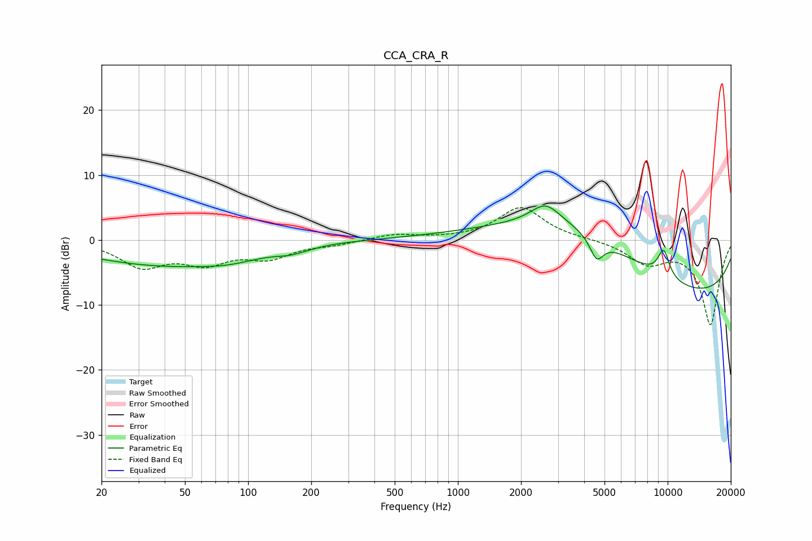

# CCA_CRA_R
See [usage instructions](https://github.com/jaakkopasanen/AutoEq#usage) for more options and info.

### Parametric EQs
Apply preamp of -5.3 dB when using parametric equalizer.

|   # | Type    |   Fc (Hz) |    Q |   Gain (dB) |
|-----|---------|-----------|------|-------------|
|   1 | Peaking |        39 | 0.37 |        -3.8 |
|   2 | Peaking |        81 | 1.07 |        -0.9 |
|   3 | Peaking |       120 | 1.65 |        -0.1 |
|   4 | Peaking |       159 | 2.16 |        -0.7 |
|   5 | Peaking |       195 | 2.47 |        -0.2 |
|   6 | Peaking |      2617 | 2.02 |         3   |
|   7 | Peaking |      3520 | 0.39 |         9.2 |
|   8 | Peaking |      4588 | 4.25 |        -3.4 |
|   9 | Peaking |      9328 | 0.19 |       -10   |
|  10 | Peaking |      9570 | 4.43 |         4.2 |

### Fixed Band EQs
When using fixed band (also called graphic) equalizer, apply preamp of **-5.1 dB** (if available) and set gains manually with these parameters.

|   # | Type    |   Fc (Hz) |    Q |   Gain (dB) |
|-----|---------|-----------|------|-------------|
|   1 | Peaking |        31 | 1.41 |        -3.8 |
|   2 | Peaking |        62 | 1.41 |        -3.1 |
|   3 | Peaking |       125 | 1.41 |        -2.5 |
|   4 | Peaking |       250 | 1.41 |        -0.6 |
|   5 | Peaking |       500 | 1.41 |         0.9 |
|   6 | Peaking |      1000 | 1.41 |         0.1 |
|   7 | Peaking |      2000 | 1.41 |         5   |
|   8 | Peaking |      4000 | 1.41 |         0.1 |
|   9 | Peaking |      8000 | 1.41 |        -3.3 |
|  10 | Peaking |     16000 | 1.41 |       -13   |

### Graphs

