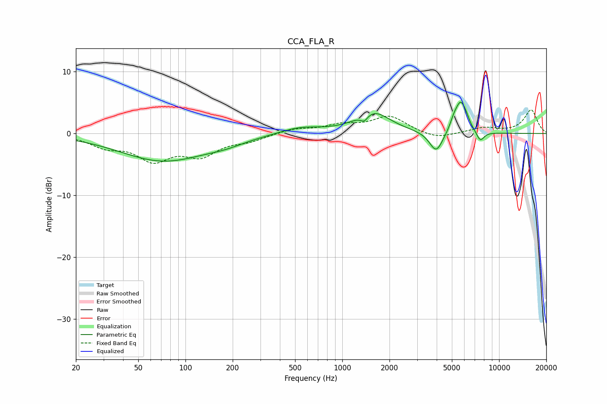

# CCA_FLA_R
See [usage instructions](https://github.com/jaakkopasanen/AutoEq#usage) for more options and info.

### Parametric EQs
Apply preamp of -5.2 dB when using parametric equalizer.

|   # | Type    |   Fc (Hz) |    Q |   Gain (dB) |
|-----|---------|-----------|------|-------------|
|   1 | Peaking |        72 | 0.51 |        -4.4 |
|   2 | Peaking |       180 | 1.17 |        -0.7 |
|   3 | Peaking |       537 | 1.07 |         1.1 |
|   4 | Peaking |      1381 | 6    |        -1.1 |
|   5 | Peaking |      1572 | 1.31 |         3.4 |
|   6 | Peaking |      3973 | 3.26 |        -3.4 |
|   7 | Peaking |      5128 | 6    |         1.1 |
|   8 | Peaking |      5674 | 3.89 |         4.8 |
|   9 | Peaking |      6180 | 6    |         0.8 |
|  10 | Peaking |      7585 | 5.38 |        -1.6 |

### Fixed Band EQs
When using fixed band (also called graphic) equalizer, apply preamp of **-3.9 dB** (if available) and set gains manually with these parameters.

|   # | Type    |   Fc (Hz) |    Q |   Gain (dB) |
|-----|---------|-----------|------|-------------|
|   1 | Peaking |        31 | 1.41 |        -1.8 |
|   2 | Peaking |        62 | 1.41 |        -3.9 |
|   3 | Peaking |       125 | 1.41 |        -3.1 |
|   4 | Peaking |       250 | 1.41 |        -1   |
|   5 | Peaking |       500 | 1.41 |         0.7 |
|   6 | Peaking |      1000 | 1.41 |         1.2 |
|   7 | Peaking |      2000 | 1.41 |         2.7 |
|   8 | Peaking |      4000 | 1.41 |        -1   |
|   9 | Peaking |      8000 | 1.41 |         0.9 |
|  10 | Peaking |     16000 | 1.41 |         3.8 |

### Graphs

