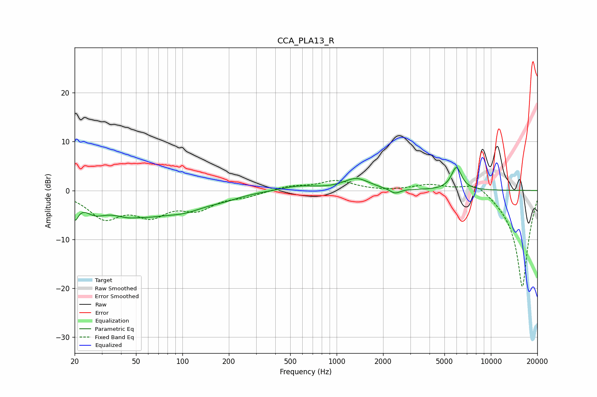

# CCA_PLA13_R
See [usage instructions](https://github.com/jaakkopasanen/AutoEq#usage) for more options and info.

### Parametric EQs
Apply preamp of -4.8 dB when using parametric equalizer.

|   # | Type    |   Fc (Hz) |    Q |   Gain (dB) |
|-----|---------|-----------|------|-------------|
|   1 | Peaking |        20 | 5.99 |        -3.9 |
|   2 | Peaking |        27 | 1.99 |        -2.7 |
|   3 | Peaking |        50 | 1    |        -5.6 |
|   4 | Peaking |        52 | 1.88 |         1.4 |
|   5 | Peaking |       102 | 0.94 |        -3   |
|   6 | Peaking |       187 | 1.26 |        -0.9 |
|   7 | Peaking |       564 | 1.25 |         0.9 |
|   8 | Peaking |      1345 | 1.72 |         2.4 |
|   9 | Peaking |      2391 | 4.32 |        -1   |
|  10 | Peaking |      5977 | 4.18 |         4.7 |

### Fixed Band EQs
When using fixed band (also called graphic) equalizer, apply preamp of **-2.1 dB** (if available) and set gains manually with these parameters.

|   # | Type    |   Fc (Hz) |    Q |   Gain (dB) |
|-----|---------|-----------|------|-------------|
|   1 | Peaking |        31 | 1.41 |        -5.2 |
|   2 | Peaking |        62 | 1.41 |        -4.3 |
|   3 | Peaking |       125 | 1.41 |        -3.3 |
|   4 | Peaking |       250 | 1.41 |        -1   |
|   5 | Peaking |       500 | 1.41 |         0.9 |
|   6 | Peaking |      1000 | 1.41 |         1.9 |
|   7 | Peaking |      2000 | 1.41 |        -0.1 |
|   8 | Peaking |      4000 | 1.41 |         1.3 |
|   9 | Peaking |      8000 | 1.41 |         2.3 |
|  10 | Peaking |     16000 | 1.41 |       -20   |

### Graphs

