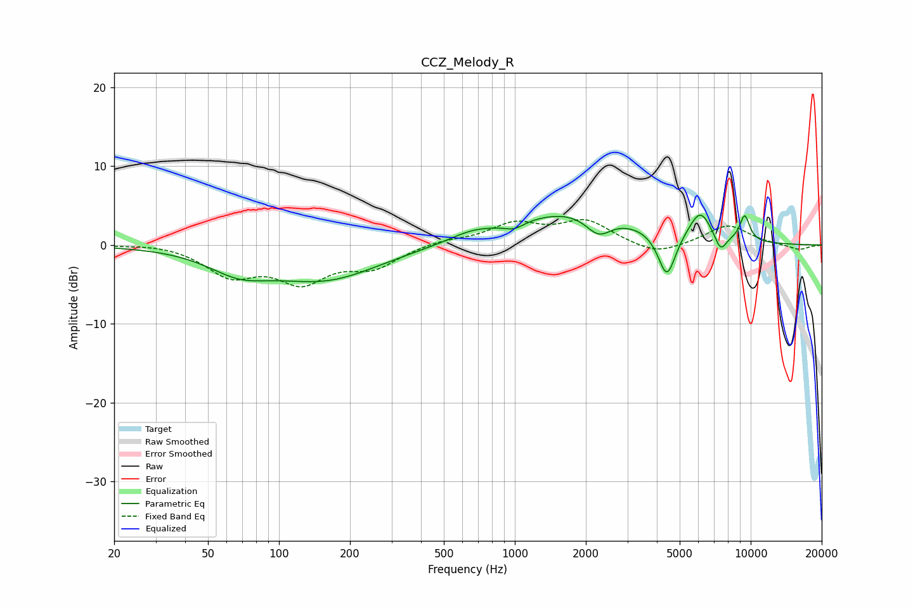

# CCZ_Melody_R
See [usage instructions](https://github.com/jaakkopasanen/AutoEq#usage) for more options and info.

### Parametric EQs
Apply preamp of -3.9 dB when using parametric equalizer.

|   # | Type    |   Fc (Hz) |    Q |   Gain (dB) |
|-----|---------|-----------|------|-------------|
|   1 | Peaking |        68 | 1.07 |        -2.6 |
|   2 | Peaking |       158 | 0.62 |        -4.2 |
|   3 | Peaking |       652 | 1.58 |         0.8 |
|   4 | Peaking |       993 | 3.38 |        -0.8 |
|   5 | Peaking |      1806 | 0.52 |         4.4 |
|   6 | Peaking |      2263 | 2.56 |        -2.6 |
|   7 | Peaking |      4411 | 3.71 |        -5.9 |
|   8 | Peaking |      6112 | 2.87 |         3.7 |
|   9 | Peaking |      7450 | 5.16 |        -2.2 |
|  10 | Peaking |      9433 | 5.81 |         3.3 |

### Fixed Band EQs
When using fixed band (also called graphic) equalizer, apply preamp of **-3.3 dB** (if available) and set gains manually with these parameters.

|   # | Type    |   Fc (Hz) |    Q |   Gain (dB) |
|-----|---------|-----------|------|-------------|
|   1 | Peaking |        31 | 1.41 |         0.3 |
|   2 | Peaking |        62 | 1.41 |        -3.6 |
|   3 | Peaking |       125 | 1.41 |        -4.2 |
|   4 | Peaking |       250 | 1.41 |        -2.6 |
|   5 | Peaking |       500 | 1.41 |         0.6 |
|   6 | Peaking |      1000 | 1.41 |         2.5 |
|   7 | Peaking |      2000 | 1.41 |         2.9 |
|   8 | Peaking |      4000 | 1.41 |        -1.4 |
|   9 | Peaking |      8000 | 1.41 |         2.5 |
|  10 | Peaking |     16000 | 1.41 |        -0.7 |

### Graphs

