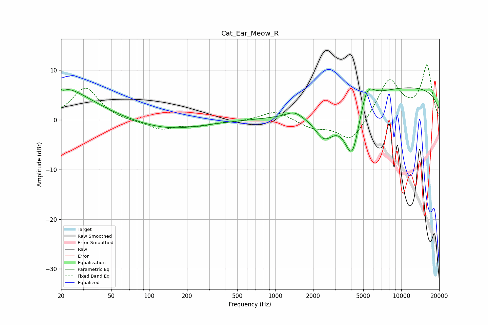

# Cat_Ear_Meow_R
See [usage instructions](https://github.com/jaakkopasanen/AutoEq#usage) for more options and info.

### Parametric EQs
Apply preamp of -6.5 dB when using parametric equalizer.

|   # | Type    |   Fc (Hz) |    Q |   Gain (dB) |
|-----|---------|-----------|------|-------------|
|   1 | Peaking |        20 | 5.66 |         3.2 |
|   2 | Peaking |        21 | 5.93 |        -3.4 |
|   3 | Peaking |        21 | 1.29 |         1.4 |
|   4 | Peaking |        23 | 0.6  |         5   |
|   5 | Peaking |       144 | 0.53 |        -1.9 |
|   6 | Peaking |      1413 | 2.41 |         1.1 |
|   7 | Peaking |      2451 | 1.71 |        -5.6 |
|   8 | Peaking |      4083 | 2.07 |       -11.8 |
|   9 | Peaking |      5341 | 2.58 |         4.9 |
|  10 | Peaking |     10000 | 0.19 |         6.7 |

### Fixed Band EQs
When using fixed band (also called graphic) equalizer, apply preamp of **-11.2 dB** (if available) and set gains manually with these parameters.

|   # | Type    |   Fc (Hz) |    Q |   Gain (dB) |
|-----|---------|-----------|------|-------------|
|   1 | Peaking |        31 | 1.41 |         6.5 |
|   2 | Peaking |        62 | 1.41 |        -0.4 |
|   3 | Peaking |       125 | 1.41 |        -1.9 |
|   4 | Peaking |       250 | 1.41 |        -1   |
|   5 | Peaking |       500 | 1.41 |        -0.3 |
|   6 | Peaking |      1000 | 1.41 |         1.9 |
|   7 | Peaking |      2000 | 1.41 |        -1.5 |
|   8 | Peaking |      4000 | 1.41 |        -4.6 |
|   9 | Peaking |      8000 | 1.41 |         8.1 |
|  10 | Peaking |     16000 | 1.41 |        10.7 |

### Graphs

