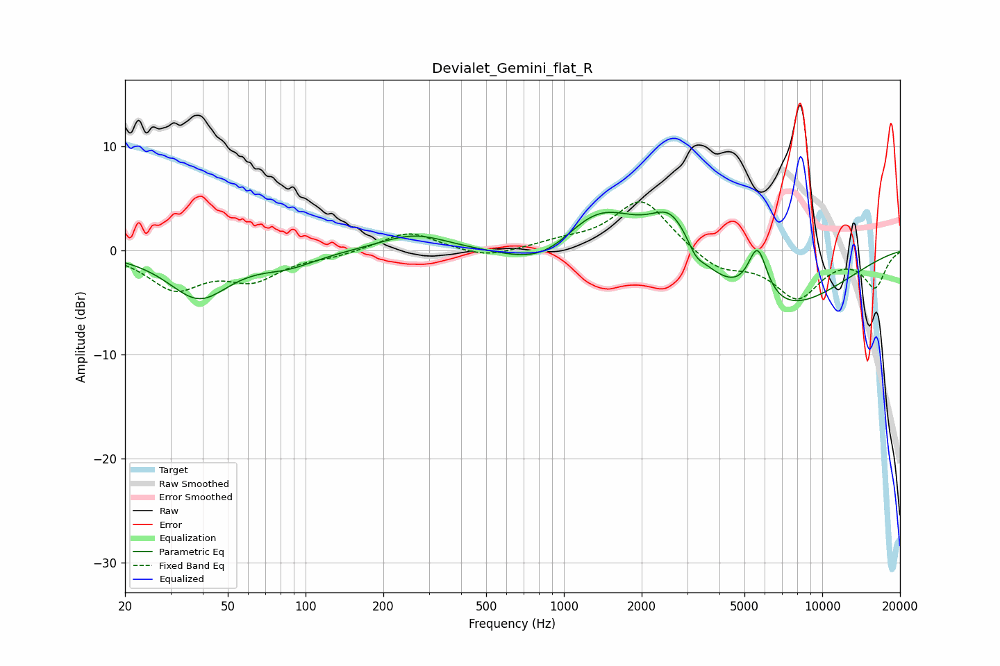

# Devialet_Gemini_flat_R
See [usage instructions](https://github.com/jaakkopasanen/AutoEq#usage) for more options and info.

### Parametric EQs
Apply preamp of -3.8 dB when using parametric equalizer.

|   # | Type    |   Fc (Hz) |    Q |   Gain (dB) |
|-----|---------|-----------|------|-------------|
|   1 | Peaking |        39 | 1.2  |        -4.5 |
|   2 | Peaking |        86 | 1.27 |        -1.2 |
|   3 | Peaking |       263 | 1.08 |         1.6 |
|   4 | Peaking |       871 | 0.9  |        -3.4 |
|   5 | Peaking |      1335 | 0.84 |         5.7 |
|   6 | Peaking |      2612 | 1.73 |         4.4 |
|   7 | Peaking |      3241 | 5.03 |        -0.9 |
|   8 | Peaking |      3332 | 1.72 |        -0.2 |
|   9 | Peaking |      5619 | 3.58 |         5.2 |
|  10 | Peaking |      6426 | 0.5  |        -6.1 |

### Fixed Band EQs
When using fixed band (also called graphic) equalizer, apply preamp of **-4.7 dB** (if available) and set gains manually with these parameters.

|   # | Type    |   Fc (Hz) |    Q |   Gain (dB) |
|-----|---------|-----------|------|-------------|
|   1 | Peaking |        31 | 1.41 |        -3.5 |
|   2 | Peaking |        62 | 1.41 |        -2.5 |
|   3 | Peaking |       125 | 1.41 |        -0.5 |
|   4 | Peaking |       250 | 1.41 |         1.8 |
|   5 | Peaking |       500 | 1.41 |        -0.8 |
|   6 | Peaking |      1000 | 1.41 |         0.6 |
|   7 | Peaking |      2000 | 1.41 |         5   |
|   8 | Peaking |      4000 | 1.41 |        -1.9 |
|   9 | Peaking |      8000 | 1.41 |        -4.4 |
|  10 | Peaking |     16000 | 1.41 |        -3.4 |

### Graphs

