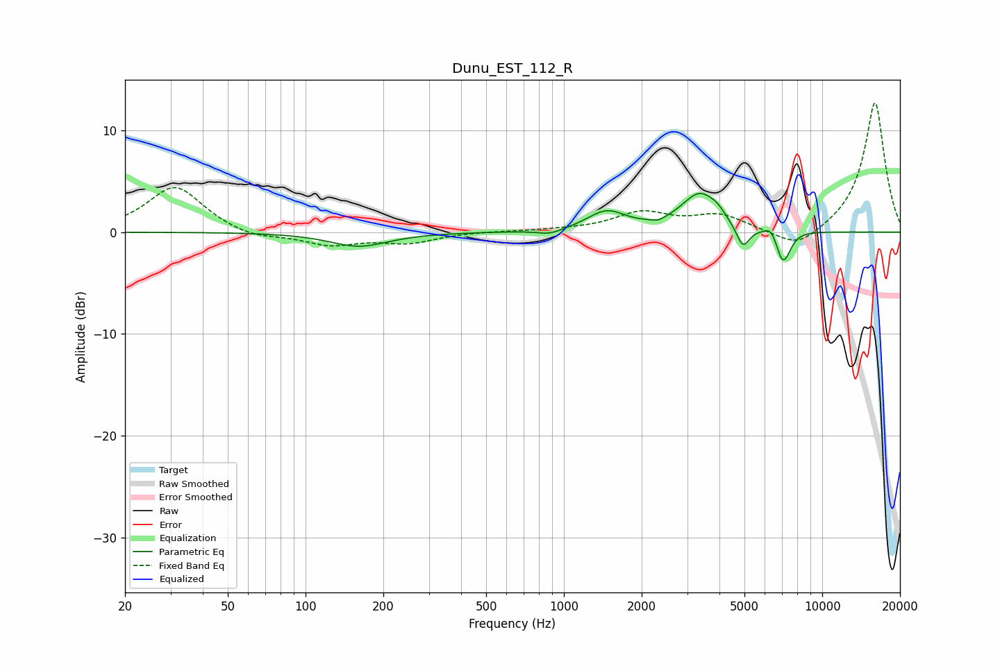

# Dunu_EST_112_R
See [usage instructions](https://github.com/jaakkopasanen/AutoEq#usage) for more options and info.

### Parametric EQs
Apply preamp of -3.9 dB when using parametric equalizer.

|   # | Type    |   Fc (Hz) |    Q |   Gain (dB) |
|-----|---------|-----------|------|-------------|
|   1 | Peaking |       161 | 1.25 |        -1.4 |
|   2 | Peaking |       882 | 2.98 |        -0.5 |
|   3 | Peaking |      1461 | 1.92 |         1.9 |
|   4 | Peaking |      2326 | 5.68 |        -0.3 |
|   5 | Peaking |      3376 | 1.95 |         3.7 |
|   6 | Peaking |      3938 | 6    |         0.4 |
|   7 | Peaking |      4930 | 5.35 |        -2.3 |
|   8 | Peaking |      6333 | 5.99 |         0.9 |
|   9 | Peaking |      7016 | 5.4  |        -2.8 |
|  10 | Peaking |      7400 | 6    |        -0.6 |

### Fixed Band EQs
When using fixed band (also called graphic) equalizer, apply preamp of **-12.8 dB** (if available) and set gains manually with these parameters.

|   # | Type    |   Fc (Hz) |    Q |   Gain (dB) |
|-----|---------|-----------|------|-------------|
|   1 | Peaking |        31 | 1.41 |         4.5 |
|   2 | Peaking |        62 | 1.41 |        -0.7 |
|   3 | Peaking |       125 | 1.41 |        -1.2 |
|   4 | Peaking |       250 | 1.41 |        -1   |
|   5 | Peaking |       500 | 1.41 |         0.1 |
|   6 | Peaking |      1000 | 1.41 |         0.1 |
|   7 | Peaking |      2000 | 1.41 |         1.8 |
|   8 | Peaking |      4000 | 1.41 |         1.6 |
|   9 | Peaking |      8000 | 1.41 |        -1.9 |
|  10 | Peaking |     16000 | 1.41 |        12.8 |

### Graphs

