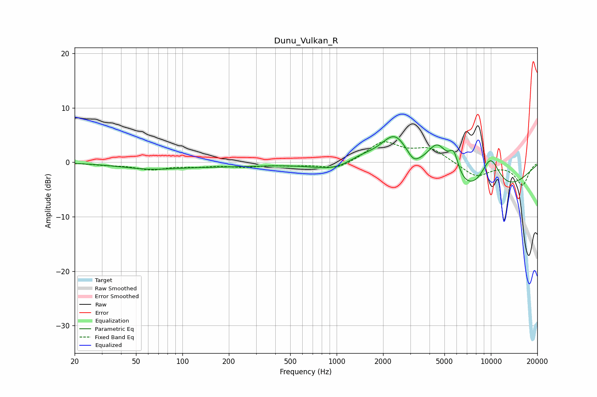

# Dunu_Vulkan_R
See [usage instructions](https://github.com/jaakkopasanen/AutoEq#usage) for more options and info.

### Parametric EQs
Apply preamp of -4.8 dB when using parametric equalizer.

|   # | Type    |   Fc (Hz) |    Q |   Gain (dB) |
|-----|---------|-----------|------|-------------|
|   1 | Peaking |        60 | 0.74 |        -1   |
|   2 | Peaking |       193 | 0.49 |        -0.6 |
|   3 | Peaking |      1041 | 0.99 |        -2   |
|   4 | Peaking |      1397 | 1.13 |         2.2 |
|   5 | Peaking |      2395 | 1.46 |         6.9 |
|   6 | Peaking |      3148 | 3.71 |        -1.4 |
|   7 | Peaking |      4519 | 1.82 |         7.5 |
|   8 | Peaking |      5746 | 4.21 |         4.3 |
|   9 | Peaking |      7677 | 0.37 |        -8.6 |
|  10 | Peaking |      9915 | 1.73 |         7.5 |

### Fixed Band EQs
When using fixed band (also called graphic) equalizer, apply preamp of **-3.8 dB** (if available) and set gains manually with these parameters.

|   # | Type    |   Fc (Hz) |    Q |   Gain (dB) |
|-----|---------|-----------|------|-------------|
|   1 | Peaking |        31 | 1.41 |        -0.4 |
|   2 | Peaking |        62 | 1.41 |        -1.2 |
|   3 | Peaking |       125 | 1.41 |        -0.6 |
|   4 | Peaking |       250 | 1.41 |        -0.7 |
|   5 | Peaking |       500 | 1.41 |        -0.4 |
|   6 | Peaking |      1000 | 1.41 |        -1.4 |
|   7 | Peaking |      2000 | 1.41 |         3.7 |
|   8 | Peaking |      4000 | 1.41 |         2.4 |
|   9 | Peaking |      8000 | 1.41 |        -2.6 |
|  10 | Peaking |     16000 | 1.41 |        -4.1 |

### Graphs

