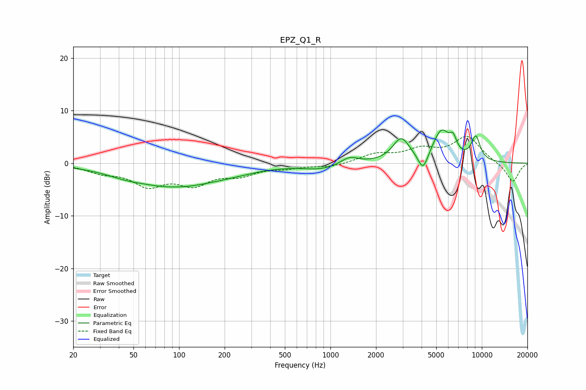

# EPZ_Q1_R
See [usage instructions](https://github.com/jaakkopasanen/AutoEq#usage) for more options and info.

### Parametric EQs
Apply preamp of -6.4 dB when using parametric equalizer.

|   # | Type    |   Fc (Hz) |    Q |   Gain (dB) |
|-----|---------|-----------|------|-------------|
|   1 | Peaking |        43 | 1.41 |        -0.4 |
|   2 | Peaking |        93 | 0.46 |        -4.4 |
|   3 | Peaking |       233 | 0.93 |        -0.4 |
|   4 | Peaking |       868 | 1.2  |        -1   |
|   5 | Peaking |      1338 | 2.49 |         1.4 |
|   6 | Peaking |      2933 | 2.51 |         4.5 |
|   7 | Peaking |      4092 | 4.29 |        -3.5 |
|   8 | Peaking |      5410 | 2.37 |         5.9 |
|   9 | Peaking |      6464 | 5.94 |         2.4 |
|  10 | Peaking |      9116 | 4.27 |         4.5 |

### Fixed Band EQs
When using fixed band (also called graphic) equalizer, apply preamp of **-5.2 dB** (if available) and set gains manually with these parameters.

|   # | Type    |   Fc (Hz) |    Q |   Gain (dB) |
|-----|---------|-----------|------|-------------|
|   1 | Peaking |        31 | 1.41 |        -1.5 |
|   2 | Peaking |        62 | 1.41 |        -3.8 |
|   3 | Peaking |       125 | 1.41 |        -3.5 |
|   4 | Peaking |       250 | 1.41 |        -1.9 |
|   5 | Peaking |       500 | 1.41 |        -0.7 |
|   6 | Peaking |      1000 | 1.41 |        -0.7 |
|   7 | Peaking |      2000 | 1.41 |         1.6 |
|   8 | Peaking |      4000 | 1.41 |         2.3 |
|   9 | Peaking |      8000 | 1.41 |         4.9 |
|  10 | Peaking |     16000 | 1.41 |        -3.7 |

### Graphs

