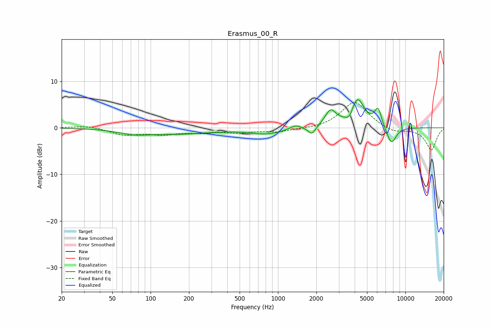

# Erasmus_00_R
See [usage instructions](https://github.com/jaakkopasanen/AutoEq#usage) for more options and info.

### Parametric EQs
Apply preamp of -6.1 dB when using parametric equalizer.

|   # | Type    |   Fc (Hz) |    Q |   Gain (dB) |
|-----|---------|-----------|------|-------------|
|   1 | Peaking |        74 | 1.17 |        -1   |
|   2 | Peaking |       170 | 0.57 |        -1.2 |
|   3 | Peaking |       810 | 1.02 |        -1.2 |
|   4 | Peaking |      1369 | 3.26 |         0.9 |
|   5 | Peaking |      1845 | 4.8  |        -1.8 |
|   6 | Peaking |      2587 | 3.25 |         3.4 |
|   7 | Peaking |      3654 | 4.71 |        -1.9 |
|   8 | Peaking |      4187 | 2.54 |         6.4 |
|   9 | Peaking |      6109 | 4.95 |         3.8 |
|  10 | Peaking |      7765 | 3.46 |        -3.8 |

### Fixed Band EQs
When using fixed band (also called graphic) equalizer, apply preamp of **-5.5 dB** (if available) and set gains manually with these parameters.

|   # | Type    |   Fc (Hz) |    Q |   Gain (dB) |
|-----|---------|-----------|------|-------------|
|   1 | Peaking |        31 | 1.41 |         0.5 |
|   2 | Peaking |        62 | 1.41 |        -1.4 |
|   3 | Peaking |       125 | 1.41 |        -1.2 |
|   4 | Peaking |       250 | 1.41 |        -0.8 |
|   5 | Peaking |       500 | 1.41 |        -0.9 |
|   6 | Peaking |      1000 | 1.41 |        -0.8 |
|   7 | Peaking |      2000 | 1.41 |        -0.3 |
|   8 | Peaking |      4000 | 1.41 |         5.7 |
|   9 | Peaking |      8000 | 1.41 |        -1.1 |
|  10 | Peaking |     16000 | 1.41 |        -4.8 |

### Graphs

