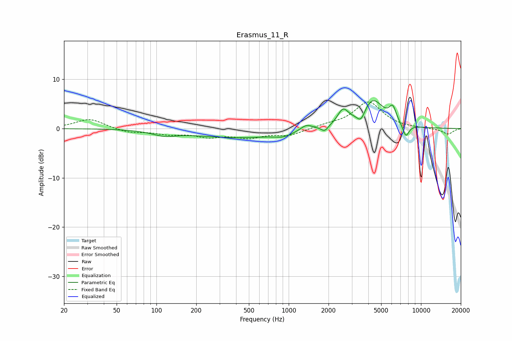

# Erasmus_11_R
See [usage instructions](https://github.com/jaakkopasanen/AutoEq#usage) for more options and info.

### Parametric EQs
Apply preamp of -5.7 dB when using parametric equalizer.

|   # | Type    |   Fc (Hz) |    Q |   Gain (dB) |
|-----|---------|-----------|------|-------------|
|   1 | Peaking |       115 | 1.57 |        -1   |
|   2 | Peaking |       428 | 0.4  |        -1.8 |
|   3 | Peaking |       906 | 2.33 |        -0.7 |
|   4 | Peaking |      1362 | 3.13 |         1.2 |
|   5 | Peaking |      1871 | 5.53 |        -1.1 |
|   6 | Peaking |      2572 | 3.41 |         3.1 |
|   7 | Peaking |      3522 | 4.51 |        -2.3 |
|   8 | Peaking |      4295 | 1.63 |         5.9 |
|   9 | Peaking |      6119 | 5.19 |         2.8 |
|  10 | Peaking |      7683 | 5.49 |        -2.6 |

### Fixed Band EQs
When using fixed band (also called graphic) equalizer, apply preamp of **-5.5 dB** (if available) and set gains manually with these parameters.

|   # | Type    |   Fc (Hz) |    Q |   Gain (dB) |
|-----|---------|-----------|------|-------------|
|   1 | Peaking |        31 | 1.41 |         2   |
|   2 | Peaking |        62 | 1.41 |        -0.8 |
|   3 | Peaking |       125 | 1.41 |        -1   |
|   4 | Peaking |       250 | 1.41 |        -1.4 |
|   5 | Peaking |       500 | 1.41 |        -1.6 |
|   6 | Peaking |      1000 | 1.41 |        -1.3 |
|   7 | Peaking |      2000 | 1.41 |         0.6 |
|   8 | Peaking |      4000 | 1.41 |         5.4 |
|   9 | Peaking |      8000 | 1.41 |         0   |
|  10 | Peaking |     16000 | 1.41 |        -1.1 |

### Graphs

