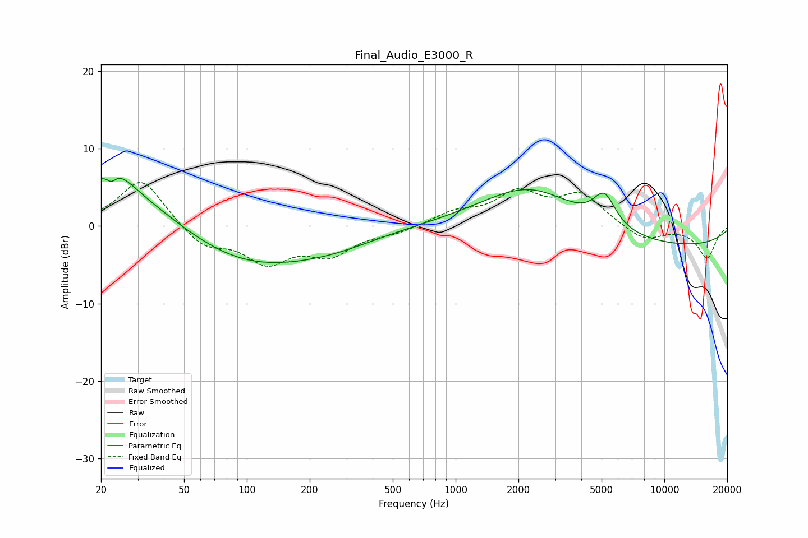

# Final_Audio_E3000_R
See [usage instructions](https://github.com/jaakkopasanen/AutoEq#usage) for more options and info.

### Parametric EQs
Apply preamp of -6.3 dB when using parametric equalizer.

|   # | Type    |   Fc (Hz) |    Q |   Gain (dB) |
|-----|---------|-----------|------|-------------|
|   1 | Peaking |        22 | 5.5  |         1.4 |
|   2 | Peaking |        22 | 5.68 |        -2.5 |
|   3 | Peaking |        23 | 0.44 |         6.4 |
|   4 | Peaking |        24 | 1.94 |         2.3 |
|   5 | Peaking |        95 | 0.39 |        -5.7 |
|   6 | Peaking |       273 | 0.71 |        -1   |
|   7 | Peaking |      2297 | 0.59 |         6.4 |
|   8 | Peaking |      5047 | 3.59 |        -0.2 |
|   9 | Peaking |      5157 | 2.64 |         4.3 |
|  10 | Peaking |      8405 | 0.2  |        -2.9 |

### Fixed Band EQs
When using fixed band (also called graphic) equalizer, apply preamp of **-5.7 dB** (if available) and set gains manually with these parameters.

|   # | Type    |   Fc (Hz) |    Q |   Gain (dB) |
|-----|---------|-----------|------|-------------|
|   1 | Peaking |        31 | 1.41 |         6.3 |
|   2 | Peaking |        62 | 1.41 |        -2.7 |
|   3 | Peaking |       125 | 1.41 |        -4.3 |
|   4 | Peaking |       250 | 1.41 |        -3.3 |
|   5 | Peaking |       500 | 1.41 |        -0.8 |
|   6 | Peaking |      1000 | 1.41 |         1.6 |
|   7 | Peaking |      2000 | 1.41 |         4   |
|   8 | Peaking |      4000 | 1.41 |         3.9 |
|   9 | Peaking |      8000 | 1.41 |        -1.9 |
|  10 | Peaking |     16000 | 1.41 |        -4.1 |

### Graphs

