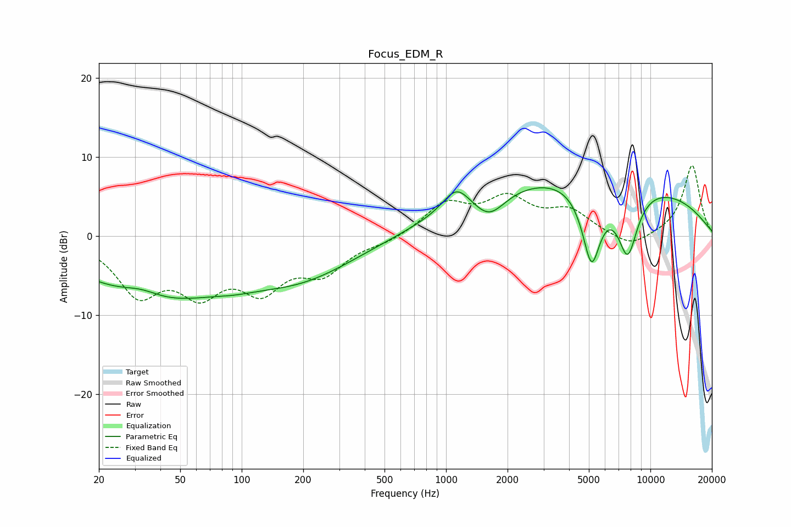

# Focus_EDM_R
See [usage instructions](https://github.com/jaakkopasanen/AutoEq#usage) for more options and info.

### Parametric EQs
Apply preamp of -6.2 dB when using parametric equalizer.

|   # | Type    |   Fc (Hz) |    Q |   Gain (dB) |
|-----|---------|-----------|------|-------------|
|   1 | Peaking |        32 | 1.46 |         1.4 |
|   2 | Peaking |        37 | 0.4  |        -7.7 |
|   3 | Peaking |        93 | 1.4  |        -0.5 |
|   4 | Peaking |       195 | 0.5  |        -4.6 |
|   5 | Peaking |      1123 | 2.17 |         3   |
|   6 | Peaking |      1630 | 1.84 |        -3   |
|   7 | Peaking |      3887 | 0.46 |         1.2 |
|   8 | Peaking |      5151 | 2.95 |        -9.8 |
|   9 | Peaking |      5266 | 0.18 |         6.8 |
|  10 | Peaking |      7739 | 2.59 |        -8.4 |

### Fixed Band EQs
When using fixed band (also called graphic) equalizer, apply preamp of **-9.0 dB** (if available) and set gains manually with these parameters.

|   # | Type    |   Fc (Hz) |    Q |   Gain (dB) |
|-----|---------|-----------|------|-------------|
|   1 | Peaking |        31 | 1.41 |        -6.7 |
|   2 | Peaking |        62 | 1.41 |        -6   |
|   3 | Peaking |       125 | 1.41 |        -5.8 |
|   4 | Peaking |       250 | 1.41 |        -4.1 |
|   5 | Peaking |       500 | 1.41 |        -0.7 |
|   6 | Peaking |      1000 | 1.41 |         3.9 |
|   7 | Peaking |      2000 | 1.41 |         4.3 |
|   8 | Peaking |      4000 | 1.41 |         2.9 |
|   9 | Peaking |      8000 | 1.41 |        -1.7 |
|  10 | Peaking |     16000 | 1.41 |         9   |

### Graphs

