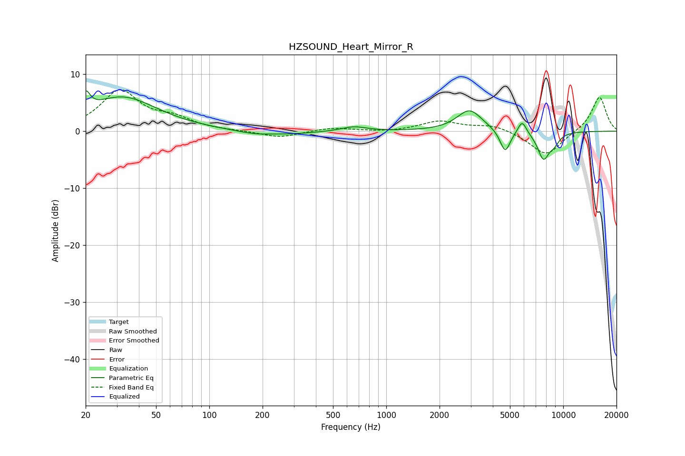

# HZSOUND_Heart_Mirror_R
See [usage instructions](https://github.com/jaakkopasanen/AutoEq#usage) for more options and info.

### Parametric EQs
Apply preamp of -7.2 dB when using parametric equalizer.

|   # | Type    |   Fc (Hz) |    Q |   Gain (dB) |
|-----|---------|-----------|------|-------------|
|   1 | Peaking |        20 | 5.77 |         3.2 |
|   2 | Peaking |        32 | 0.72 |         5.9 |
|   3 | Peaking |       182 | 1.28 |        -0.7 |
|   4 | Peaking |       302 | 1.06 |        -0.4 |
|   5 | Peaking |       656 | 2.01 |         0.8 |
|   6 | Peaking |      2955 | 2    |         3.8 |
|   7 | Peaking |      4698 | 4.75 |        -4   |
|   8 | Peaking |      5860 | 5.7  |         2.3 |
|   9 | Peaking |      7729 | 3.91 |        -4.7 |
|  10 | Peaking |      8892 | 4.22 |        -1.5 |

### Fixed Band EQs
When using fixed band (also called graphic) equalizer, apply preamp of **-7.4 dB** (if available) and set gains manually with these parameters.

|   # | Type    |   Fc (Hz) |    Q |   Gain (dB) |
|-----|---------|-----------|------|-------------|
|   1 | Peaking |        31 | 1.41 |         7   |
|   2 | Peaking |        62 | 1.41 |         1.9 |
|   3 | Peaking |       125 | 1.41 |         0   |
|   4 | Peaking |       250 | 1.41 |        -1.2 |
|   5 | Peaking |       500 | 1.41 |         0.6 |
|   6 | Peaking |      1000 | 1.41 |        -0.2 |
|   7 | Peaking |      2000 | 1.41 |         1.7 |
|   8 | Peaking |      4000 | 1.41 |         1.1 |
|   9 | Peaking |      8000 | 1.41 |        -4.3 |
|  10 | Peaking |     16000 | 1.41 |         6.2 |

### Graphs

