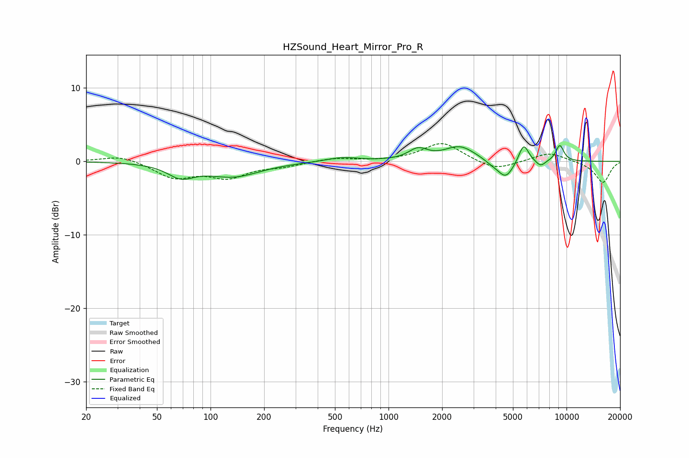

# HZSound_Heart_Mirror_Pro_R
See [usage instructions](https://github.com/jaakkopasanen/AutoEq#usage) for more options and info.

### Parametric EQs
Apply preamp of -2.2 dB when using parametric equalizer.

|   # | Type    |   Fc (Hz) |    Q |   Gain (dB) |
|-----|---------|-----------|------|-------------|
|   1 | Peaking |        68 | 1.9  |        -1.8 |
|   2 | Peaking |       135 | 0.94 |        -2   |
|   3 | Peaking |       549 | 1.55 |         0.6 |
|   4 | Peaking |      1463 | 2.69 |         1.4 |
|   5 | Peaking |      2519 | 1.62 |         2   |
|   6 | Peaking |      3817 | 3.25 |        -0.4 |
|   7 | Peaking |      4556 | 3.06 |        -2.4 |
|   8 | Peaking |      5744 | 4.92 |         2.6 |
|   9 | Peaking |      7155 | 4.85 |        -0.9 |
|  10 | Peaking |      9167 | 5.49 |         2.2 |

### Fixed Band EQs
When using fixed band (also called graphic) equalizer, apply preamp of **-2.5 dB** (if available) and set gains manually with these parameters.

|   # | Type    |   Fc (Hz) |    Q |   Gain (dB) |
|-----|---------|-----------|------|-------------|
|   1 | Peaking |        31 | 1.41 |         0.9 |
|   2 | Peaking |        62 | 1.41 |        -2.1 |
|   3 | Peaking |       125 | 1.41 |        -2   |
|   4 | Peaking |       250 | 1.41 |        -0.6 |
|   5 | Peaking |       500 | 1.41 |         0.5 |
|   6 | Peaking |      1000 | 1.41 |         0   |
|   7 | Peaking |      2000 | 1.41 |         2.6 |
|   8 | Peaking |      4000 | 1.41 |        -1.3 |
|   9 | Peaking |      8000 | 1.41 |         1.2 |
|  10 | Peaking |     16000 | 1.41 |        -2.9 |

### Graphs

