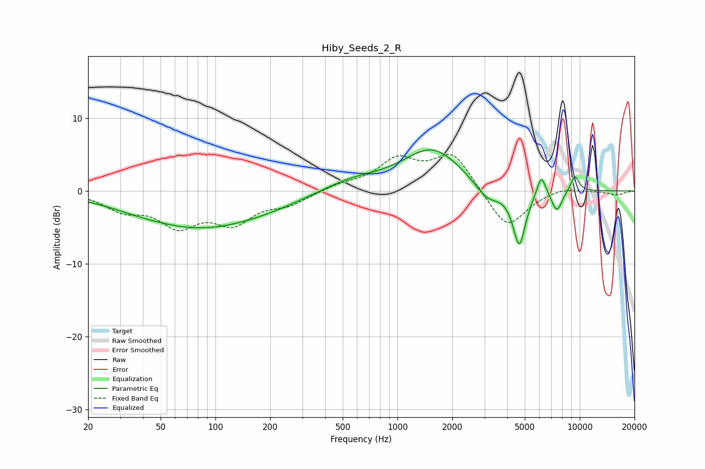

# Hiby_Seeds_2_R
See [usage instructions](https://github.com/jaakkopasanen/AutoEq#usage) for more options and info.

### Parametric EQs
Apply preamp of -5.7 dB when using parametric equalizer.

|   # | Type    |   Fc (Hz) |    Q |   Gain (dB) |
|-----|---------|-----------|------|-------------|
|   1 | Peaking |        36 | 1.3  |        -0.2 |
|   2 | Peaking |        80 | 0.41 |        -4.9 |
|   3 | Peaking |       198 | 0.72 |        -0.6 |
|   4 | Peaking |       560 | 0.87 |         1.4 |
|   5 | Peaking |      1551 | 0.86 |         5.7 |
|   6 | Peaking |      3116 | 1.97 |        -2.4 |
|   7 | Peaking |      4659 | 3.94 |        -7.7 |
|   8 | Peaking |      6155 | 5.61 |         2.9 |
|   9 | Peaking |      7499 | 4.65 |        -2.9 |
|  10 | Peaking |      9409 | 5.3  |         2.2 |

### Fixed Band EQs
When using fixed band (also called graphic) equalizer, apply preamp of **-5.1 dB** (if available) and set gains manually with these parameters.

|   # | Type    |   Fc (Hz) |    Q |   Gain (dB) |
|-----|---------|-----------|------|-------------|
|   1 | Peaking |        31 | 1.41 |        -2.3 |
|   2 | Peaking |        62 | 1.41 |        -4.3 |
|   3 | Peaking |       125 | 1.41 |        -3.9 |
|   4 | Peaking |       250 | 1.41 |        -1.6 |
|   5 | Peaking |       500 | 1.41 |         0.8 |
|   6 | Peaking |      1000 | 1.41 |         4   |
|   7 | Peaking |      2000 | 1.41 |         5.1 |
|   8 | Peaking |      4000 | 1.41 |        -5.4 |
|   9 | Peaking |      8000 | 1.41 |         0.6 |
|  10 | Peaking |     16000 | 1.41 |        -0.5 |

### Graphs

