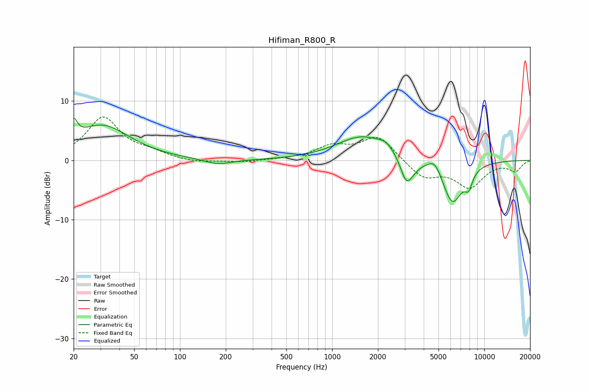

# Hifiman_R800_R
See [usage instructions](https://github.com/jaakkopasanen/AutoEq#usage) for more options and info.

### Parametric EQs
Apply preamp of -7.2 dB when using parametric equalizer.

|   # | Type    |   Fc (Hz) |    Q |   Gain (dB) |
|-----|---------|-----------|------|-------------|
|   1 | Peaking |        20 | 5.94 |         3.1 |
|   2 | Peaking |        31 | 0.78 |         5.8 |
|   3 | Peaking |       178 | 1.56 |        -0.9 |
|   4 | Peaking |      1580 | 0.84 |         4   |
|   5 | Peaking |      2265 | 2.89 |         1.1 |
|   6 | Peaking |      3066 | 3.65 |        -3.9 |
|   7 | Peaking |      3376 | 3.07 |        -1.1 |
|   8 | Peaking |      4752 | 3.14 |         2.1 |
|   9 | Peaking |      6154 | 1.99 |        -7.4 |
|  10 | Peaking |      7893 | 5.12 |        -2.4 |

### Fixed Band EQs
When using fixed band (also called graphic) equalizer, apply preamp of **-7.4 dB** (if available) and set gains manually with these parameters.

|   # | Type    |   Fc (Hz) |    Q |   Gain (dB) |
|-----|---------|-----------|------|-------------|
|   1 | Peaking |        31 | 1.41 |         7.1 |
|   2 | Peaking |        62 | 1.41 |         1   |
|   3 | Peaking |       125 | 1.41 |        -0.4 |
|   4 | Peaking |       250 | 1.41 |        -0.3 |
|   5 | Peaking |       500 | 1.41 |         0.1 |
|   6 | Peaking |      1000 | 1.41 |         2.2 |
|   7 | Peaking |      2000 | 1.41 |         4   |
|   8 | Peaking |      4000 | 1.41 |        -2.9 |
|   9 | Peaking |      8000 | 1.41 |        -4.3 |
|  10 | Peaking |     16000 | 1.41 |        -1.7 |

### Graphs

