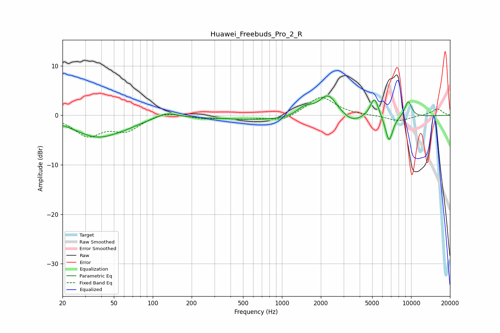

# Huawei_Freebuds_Pro_2_R
See [usage instructions](https://github.com/jaakkopasanen/AutoEq#usage) for more options and info.

### Parametric EQs
Apply preamp of -4.0 dB when using parametric equalizer.

|   # | Type    |   Fc (Hz) |    Q |   Gain (dB) |
|-----|---------|-----------|------|-------------|
|   1 | Peaking |        37 | 0.79 |        -4.2 |
|   2 | Peaking |        63 | 1.37 |        -0.5 |
|   3 | Peaking |       129 | 1.85 |         1.1 |
|   4 | Peaking |      1505 | 2.25 |         1.9 |
|   5 | Peaking |      1633 | 0.18 |        -1.1 |
|   6 | Peaking |      2273 | 1.95 |         4.8 |
|   7 | Peaking |      3466 | 2.25 |        -1.1 |
|   8 | Peaking |      5203 | 4.06 |         4.4 |
|   9 | Peaking |      6752 | 4.74 |        -5.1 |
|  10 | Peaking |      9488 | 4.45 |         3.3 |

### Fixed Band EQs
When using fixed band (also called graphic) equalizer, apply preamp of **-3.7 dB** (if available) and set gains manually with these parameters.

|   # | Type    |   Fc (Hz) |    Q |   Gain (dB) |
|-----|---------|-----------|------|-------------|
|   1 | Peaking |        31 | 1.41 |        -3.9 |
|   2 | Peaking |        62 | 1.41 |        -2.8 |
|   3 | Peaking |       125 | 1.41 |         0.9 |
|   4 | Peaking |       250 | 1.41 |        -0.6 |
|   5 | Peaking |       500 | 1.41 |        -0.6 |
|   6 | Peaking |      1000 | 1.41 |        -1.2 |
|   7 | Peaking |      2000 | 1.41 |         3.9 |
|   8 | Peaking |      4000 | 1.41 |        -0   |
|   9 | Peaking |      8000 | 1.41 |        -1.2 |
|  10 | Peaking |     16000 | 1.41 |         1.3 |

### Graphs

