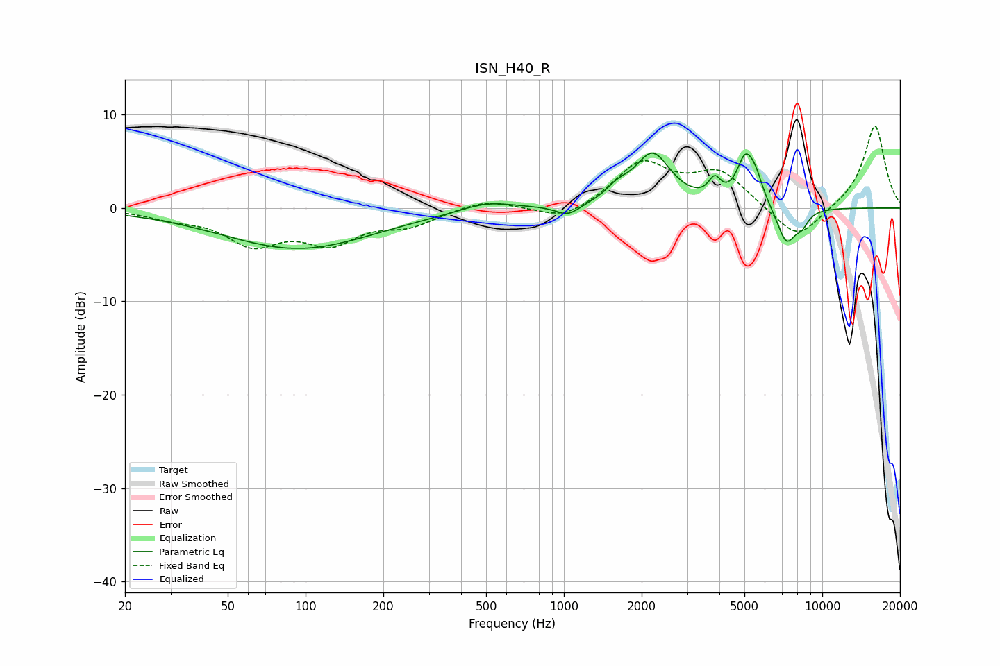

# ISN_H40_R
See [usage instructions](https://github.com/jaakkopasanen/AutoEq#usage) for more options and info.

### Parametric EQs
Apply preamp of -6.0 dB when using parametric equalizer.

|   # | Type    |   Fc (Hz) |    Q |   Gain (dB) |
|-----|---------|-----------|------|-------------|
|   1 | Peaking |        94 | 0.48 |        -4.3 |
|   2 | Peaking |       503 | 1.38 |         1   |
|   3 | Peaking |      1038 | 3    |        -1.2 |
|   4 | Peaking |      1614 | 3.23 |         1.1 |
|   5 | Peaking |      2204 | 2.02 |         5.6 |
|   6 | Peaking |      3835 | 5.97 |         2   |
|   7 | Peaking |      5025 | 4.3  |         4.4 |
|   8 | Peaking |      5520 | 4.58 |         2.4 |
|   9 | Peaking |      7268 | 3.66 |        -3.9 |
|  10 | Peaking |      8343 | 5.11 |        -1.3 |

### Fixed Band EQs
When using fixed band (also called graphic) equalizer, apply preamp of **-8.9 dB** (if available) and set gains manually with these parameters.

|   # | Type    |   Fc (Hz) |    Q |   Gain (dB) |
|-----|---------|-----------|------|-------------|
|   1 | Peaking |        31 | 1.41 |        -0.8 |
|   2 | Peaking |        62 | 1.41 |        -3.5 |
|   3 | Peaking |       125 | 1.41 |        -3.3 |
|   4 | Peaking |       250 | 1.41 |        -1.6 |
|   5 | Peaking |       500 | 1.41 |         1   |
|   6 | Peaking |      1000 | 1.41 |        -1.5 |
|   7 | Peaking |      2000 | 1.41 |         4.7 |
|   8 | Peaking |      4000 | 1.41 |         3.7 |
|   9 | Peaking |      8000 | 1.41 |        -3.7 |
|  10 | Peaking |     16000 | 1.41 |         8.9 |

### Graphs

