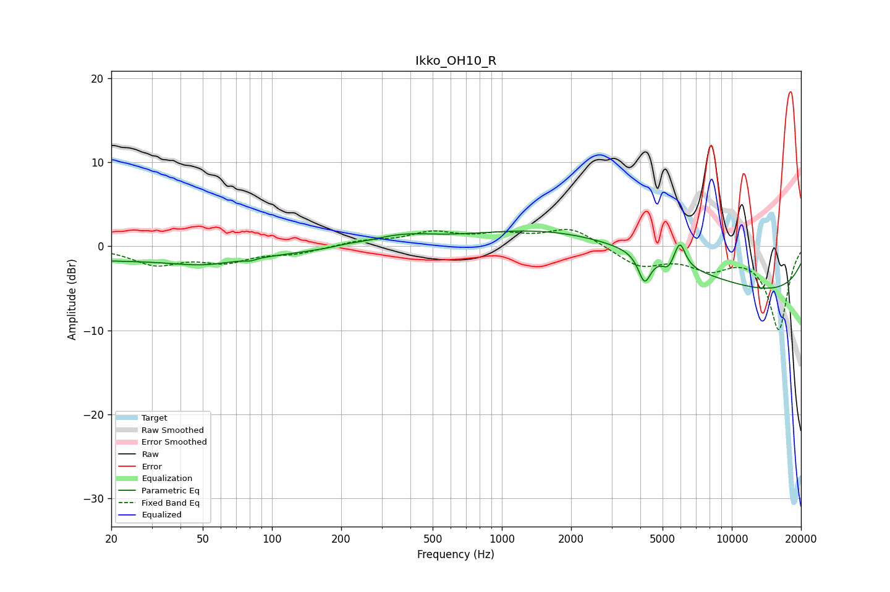

# Ikko_OH10_R
See [usage instructions](https://github.com/jaakkopasanen/AutoEq#usage) for more options and info.

### Parametric EQs
Apply preamp of -1.9 dB when using parametric equalizer.

|   # | Type    |   Fc (Hz) |    Q |   Gain (dB) |
|-----|---------|-----------|------|-------------|
|   1 | Peaking |        25 | 0.18 |        -1.7 |
|   2 | Peaking |        50 | 1.17 |        -0.7 |
|   3 | Peaking |        80 | 5.82 |        -0.3 |
|   4 | Peaking |       212 | 2.91 |         0.2 |
|   5 | Peaking |       365 | 1.01 |         1.1 |
|   6 | Peaking |      2822 | 0.32 |         4.4 |
|   7 | Peaking |      4174 | 5.26 |        -3.4 |
|   8 | Peaking |      5283 | 5.99 |        -1   |
|   9 | Peaking |      5945 | 5.77 |         2.9 |
|  10 | Peaking |     10000 | 0.18 |        -6   |

### Fixed Band EQs
When using fixed band (also called graphic) equalizer, apply preamp of **-2.1 dB** (if available) and set gains manually with these parameters.

|   # | Type    |   Fc (Hz) |    Q |   Gain (dB) |
|-----|---------|-----------|------|-------------|
|   1 | Peaking |        31 | 1.41 |        -2   |
|   2 | Peaking |        62 | 1.41 |        -1.6 |
|   3 | Peaking |       125 | 1.41 |        -0.8 |
|   4 | Peaking |       250 | 1.41 |         0.6 |
|   5 | Peaking |       500 | 1.41 |         1.5 |
|   6 | Peaking |      1000 | 1.41 |         1.2 |
|   7 | Peaking |      2000 | 1.41 |         2.2 |
|   8 | Peaking |      4000 | 1.41 |        -2.3 |
|   9 | Peaking |      8000 | 1.41 |        -2.3 |
|  10 | Peaking |     16000 | 1.41 |        -9.8 |

### Graphs

