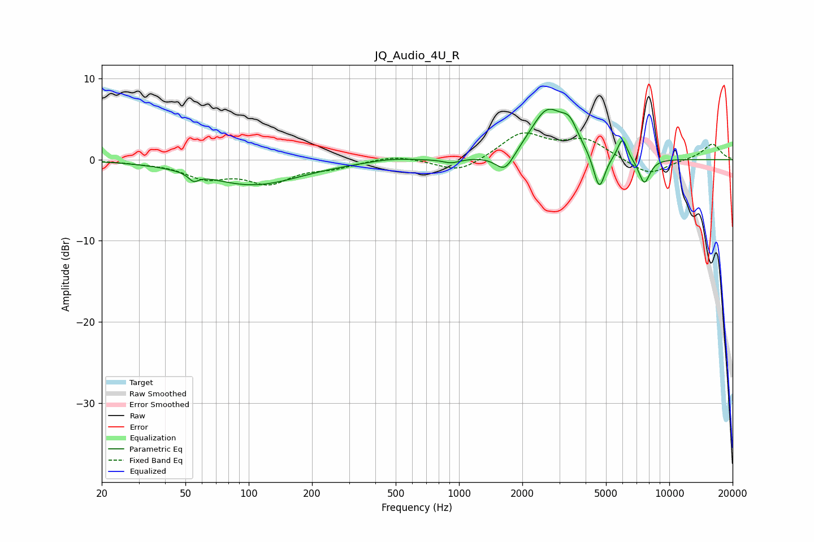

# JQ_Audio_4U_R
See [usage instructions](https://github.com/jaakkopasanen/AutoEq#usage) for more options and info.

### Parametric EQs
Apply preamp of -6.3 dB when using parametric equalizer.

|   # | Type    |   Fc (Hz) |    Q |   Gain (dB) |
|-----|---------|-----------|------|-------------|
|   1 | Peaking |        55 | 5.99 |        -0.9 |
|   2 | Peaking |       105 | 0.62 |        -3.1 |
|   3 | Peaking |       473 | 1.42 |         0.4 |
|   4 | Peaking |       919 | 3.5  |        -0.5 |
|   5 | Peaking |      1655 | 3.12 |        -2.5 |
|   6 | Peaking |      2632 | 1.72 |         6   |
|   7 | Peaking |      3356 | 3.62 |         2.4 |
|   8 | Peaking |      4644 | 5.1  |        -4.6 |
|   9 | Peaking |      5987 | 5.99 |         2.6 |
|  10 | Peaking |      7607 | 4.85 |        -3.1 |

### Fixed Band EQs
When using fixed band (also called graphic) equalizer, apply preamp of **-3.4 dB** (if available) and set gains manually with these parameters.

|   # | Type    |   Fc (Hz) |    Q |   Gain (dB) |
|-----|---------|-----------|------|-------------|
|   1 | Peaking |        31 | 1.41 |        -0.2 |
|   2 | Peaking |        62 | 1.41 |        -2   |
|   3 | Peaking |       125 | 1.41 |        -2.6 |
|   4 | Peaking |       250 | 1.41 |        -0.8 |
|   5 | Peaking |       500 | 1.41 |         0.6 |
|   6 | Peaking |      1000 | 1.41 |        -1.7 |
|   7 | Peaking |      2000 | 1.41 |         3.2 |
|   8 | Peaking |      4000 | 1.41 |         2.3 |
|   9 | Peaking |      8000 | 1.41 |        -2   |
|  10 | Peaking |     16000 | 1.41 |         2   |

### Graphs

