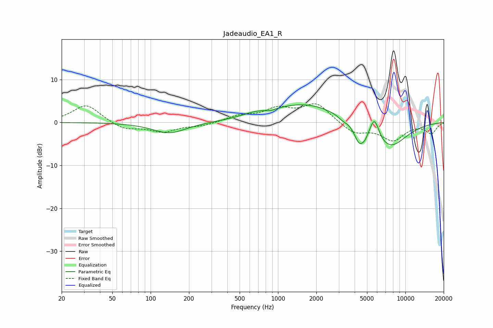

# Jadeaudio_EA1_R
See [usage instructions](https://github.com/jaakkopasanen/AutoEq#usage) for more options and info.

### Parametric EQs
Apply preamp of -4.2 dB when using parametric equalizer.

|   # | Type    |   Fc (Hz) |    Q |   Gain (dB) |
|-----|---------|-----------|------|-------------|
|   1 | Peaking |       140 | 1.09 |        -2.5 |
|   2 | Peaking |       655 | 1.34 |         0.8 |
|   3 | Peaking |       875 | 3.61 |        -0.5 |
|   4 | Peaking |      1639 | 0.51 |         4.4 |
|   5 | Peaking |      3207 | 4.25 |        -0.6 |
|   6 | Peaking |      4353 | 3.43 |        -4.4 |
|   7 | Peaking |      4824 | 6    |        -1   |
|   8 | Peaking |      5662 | 4.49 |         3.8 |
|   9 | Peaking |      6034 | 5.47 |         0.9 |
|  10 | Peaking |      7510 | 0.99 |        -6   |

### Fixed Band EQs
When using fixed band (also called graphic) equalizer, apply preamp of **-4.5 dB** (if available) and set gains manually with these parameters.

|   # | Type    |   Fc (Hz) |    Q |   Gain (dB) |
|-----|---------|-----------|------|-------------|
|   1 | Peaking |        31 | 1.41 |         4.2 |
|   2 | Peaking |        62 | 1.41 |        -1.7 |
|   3 | Peaking |       125 | 1.41 |        -2.1 |
|   4 | Peaking |       250 | 1.41 |        -0.7 |
|   5 | Peaking |       500 | 1.41 |         1.4 |
|   6 | Peaking |      1000 | 1.41 |         2.9 |
|   7 | Peaking |      2000 | 1.41 |         4.3 |
|   8 | Peaking |      4000 | 1.41 |        -2.6 |
|   9 | Peaking |      8000 | 1.41 |        -3.9 |
|  10 | Peaking |     16000 | 1.41 |        -2.5 |

### Graphs

