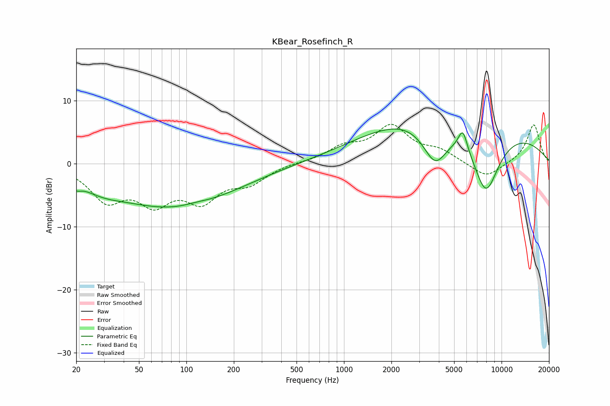

# KBear_Rosefinch_R
See [usage instructions](https://github.com/jaakkopasanen/AutoEq#usage) for more options and info.

### Parametric EQs
Apply preamp of -5.6 dB when using parametric equalizer.

|   # | Type    |   Fc (Hz) |    Q |   Gain (dB) |
|-----|---------|-----------|------|-------------|
|   1 | Peaking |        20 | 4.99 |        -1   |
|   2 | Peaking |        29 | 1.08 |        -1.4 |
|   3 | Peaking |        84 | 0.35 |        -6.9 |
|   4 | Peaking |       115 | 1.87 |         0.3 |
|   5 | Peaking |       383 | 0.19 |         0.3 |
|   6 | Peaking |      3714 | 0.36 |         3.1 |
|   7 | Peaking |      3793 | 1.7  |        -6.7 |
|   8 | Peaking |      5679 | 4.93 |         3.3 |
|   9 | Peaking |      5959 | 0.2  |         6   |
|  10 | Peaking |      7943 | 1.4  |       -11.3 |

### Fixed Band EQs
When using fixed band (also called graphic) equalizer, apply preamp of **-6.4 dB** (if available) and set gains manually with these parameters.

|   # | Type    |   Fc (Hz) |    Q |   Gain (dB) |
|-----|---------|-----------|------|-------------|
|   1 | Peaking |        31 | 1.41 |        -5.3 |
|   2 | Peaking |        62 | 1.41 |        -5.3 |
|   3 | Peaking |       125 | 1.41 |        -5.1 |
|   4 | Peaking |       250 | 1.41 |        -2.7 |
|   5 | Peaking |       500 | 1.41 |         0.2 |
|   6 | Peaking |      1000 | 1.41 |         2.3 |
|   7 | Peaking |      2000 | 1.41 |         5.6 |
|   8 | Peaking |      4000 | 1.41 |         1.8 |
|   9 | Peaking |      8000 | 1.41 |        -2.4 |
|  10 | Peaking |     16000 | 1.41 |         6.3 |

### Graphs

