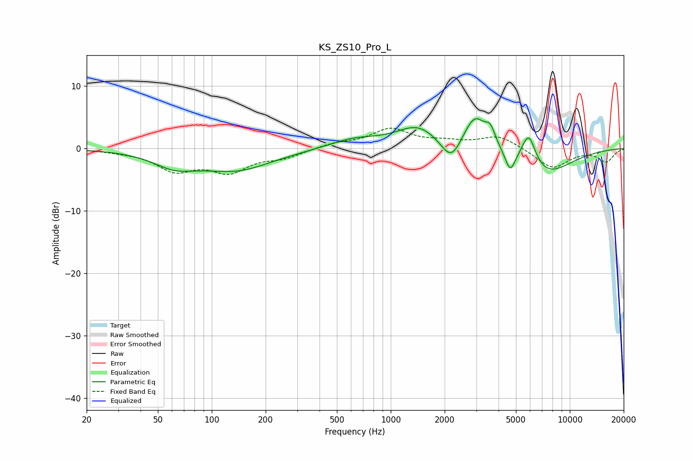

# KS_ZS10_Pro_L
See [usage instructions](https://github.com/jaakkopasanen/AutoEq#usage) for more options and info.

### Parametric EQs
Apply preamp of -4.9 dB when using parametric equalizer.

|   # | Type    |   Fc (Hz) |    Q |   Gain (dB) |
|-----|---------|-----------|------|-------------|
|   1 | Peaking |        62 | 1.17 |        -2.2 |
|   2 | Peaking |       137 | 0.7  |        -3.3 |
|   3 | Peaking |       625 | 1.03 |         1.4 |
|   4 | Peaking |      1418 | 1.17 |         3.5 |
|   5 | Peaking |      2179 | 2.41 |        -4.1 |
|   6 | Peaking |      2951 | 2.1  |         5.7 |
|   7 | Peaking |      3603 | 5.46 |         2.2 |
|   8 | Peaking |      4644 | 5.05 |        -3.2 |
|   9 | Peaking |      5895 | 3.45 |         5.4 |
|  10 | Peaking |      7124 | 0.9  |        -4.5 |

### Fixed Band EQs
When using fixed band (also called graphic) equalizer, apply preamp of **-3.3 dB** (if available) and set gains manually with these parameters.

|   # | Type    |   Fc (Hz) |    Q |   Gain (dB) |
|-----|---------|-----------|------|-------------|
|   1 | Peaking |        31 | 1.41 |        -0.3 |
|   2 | Peaking |        62 | 1.41 |        -3.2 |
|   3 | Peaking |       125 | 1.41 |        -3.4 |
|   4 | Peaking |       250 | 1.41 |        -1.3 |
|   5 | Peaking |       500 | 1.41 |         0.8 |
|   6 | Peaking |      1000 | 1.41 |         3   |
|   7 | Peaking |      2000 | 1.41 |         0.8 |
|   8 | Peaking |      4000 | 1.41 |         2   |
|   9 | Peaking |      8000 | 1.41 |        -3.2 |
|  10 | Peaking |     16000 | 1.41 |        -2   |

### Graphs

