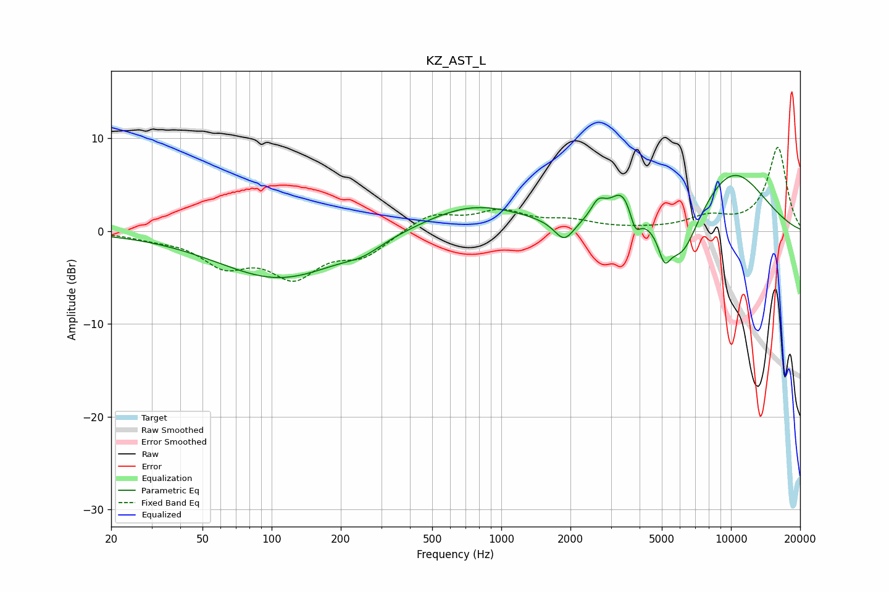

# KZ_AST_L
See [usage instructions](https://github.com/jaakkopasanen/AutoEq#usage) for more options and info.

### Parametric EQs
Apply preamp of -6.1 dB when using parametric equalizer.

|   # | Type    |   Fc (Hz) |    Q |   Gain (dB) |
|-----|---------|-----------|------|-------------|
|   1 | Peaking |       108 | 0.52 |        -5.1 |
|   2 | Peaking |       250 | 1.82 |        -0.9 |
|   3 | Peaking |       751 | 0.64 |         2.9 |
|   4 | Peaking |      1878 | 3.26 |        -2.3 |
|   5 | Peaking |      2642 | 4.34 |         1.9 |
|   6 | Peaking |      3368 | 2.62 |         3.6 |
|   7 | Peaking |      3832 | 6    |        -2.3 |
|   8 | Peaking |      5131 | 5.43 |        -2.8 |
|   9 | Peaking |      6117 | 1.77 |        -5.5 |
|  10 | Peaking |     10000 | 0.73 |         6.8 |

### Fixed Band EQs
When using fixed band (also called graphic) equalizer, apply preamp of **-9.1 dB** (if available) and set gains manually with these parameters.

|   # | Type    |   Fc (Hz) |    Q |   Gain (dB) |
|-----|---------|-----------|------|-------------|
|   1 | Peaking |        31 | 1.41 |        -0.5 |
|   2 | Peaking |        62 | 1.41 |        -3.3 |
|   3 | Peaking |       125 | 1.41 |        -4.4 |
|   4 | Peaking |       250 | 1.41 |        -2.4 |
|   5 | Peaking |       500 | 1.41 |         1.9 |
|   6 | Peaking |      1000 | 1.41 |         2   |
|   7 | Peaking |      2000 | 1.41 |         0.9 |
|   8 | Peaking |      4000 | 1.41 |         0.1 |
|   9 | Peaking |      8000 | 1.41 |         1.3 |
|  10 | Peaking |     16000 | 1.41 |         9   |

### Graphs

