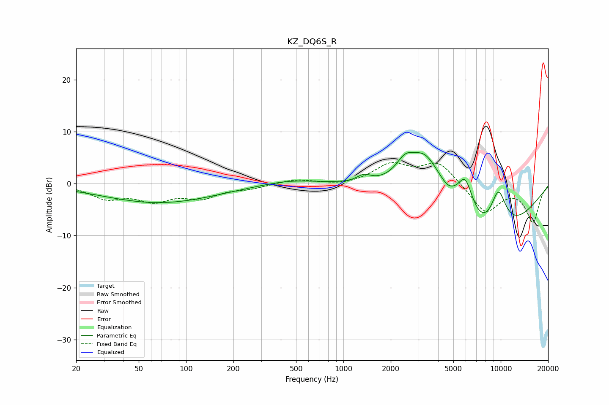

# KZ_DQ6S_R
See [usage instructions](https://github.com/jaakkopasanen/AutoEq#usage) for more options and info.

### Parametric EQs
Apply preamp of -6.1 dB when using parametric equalizer.

|   # | Type    |   Fc (Hz) |    Q |   Gain (dB) |
|-----|---------|-----------|------|-------------|
|   1 | Peaking |        50 | 0.36 |        -0.4 |
|   2 | Peaking |        69 | 0.4  |        -3.3 |
|   3 | Peaking |       459 | 0.81 |         0.9 |
|   4 | Peaking |      1350 | 3.22 |         1.3 |
|   5 | Peaking |      2462 | 2.51 |         3   |
|   6 | Peaking |      3313 | 1.15 |         9.8 |
|   7 | Peaking |      4572 | 4.66 |        -0.4 |
|   8 | Peaking |      5955 | 2.59 |         7.5 |
|   9 | Peaking |      8078 | 0.45 |       -12.6 |
|  10 | Peaking |      9656 | 2.23 |         8.7 |

### Fixed Band EQs
When using fixed band (also called graphic) equalizer, apply preamp of **-4.2 dB** (if available) and set gains manually with these parameters.

|   # | Type    |   Fc (Hz) |    Q |   Gain (dB) |
|-----|---------|-----------|------|-------------|
|   1 | Peaking |        31 | 1.41 |        -2.6 |
|   2 | Peaking |        62 | 1.41 |        -2.9 |
|   3 | Peaking |       125 | 1.41 |        -2.4 |
|   4 | Peaking |       250 | 1.41 |        -0.8 |
|   5 | Peaking |       500 | 1.41 |         0.9 |
|   6 | Peaking |      1000 | 1.41 |        -0.5 |
|   7 | Peaking |      2000 | 1.41 |         3.5 |
|   8 | Peaking |      4000 | 1.41 |         4.1 |
|   9 | Peaking |      8000 | 1.41 |        -5.6 |
|  10 | Peaking |     16000 | 1.41 |        -7.2 |

### Graphs

