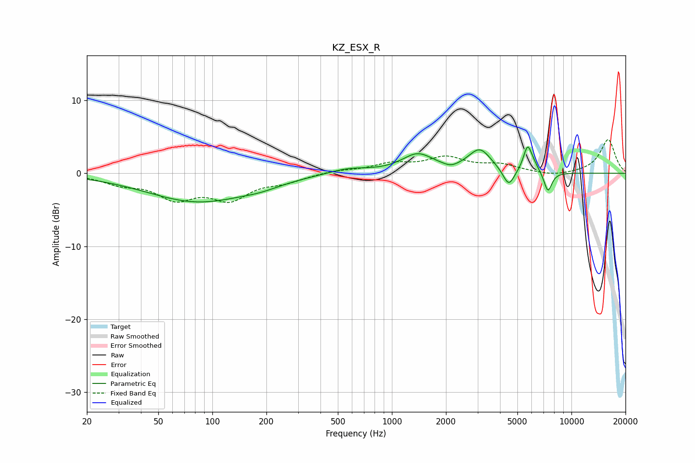

# KZ_ESX_R
See [usage instructions](https://github.com/jaakkopasanen/AutoEq#usage) for more options and info.

### Parametric EQs
Apply preamp of -3.7 dB when using parametric equalizer.

|   # | Type    |   Fc (Hz) |    Q |   Gain (dB) |
|-----|---------|-----------|------|-------------|
|   1 | Peaking |        83 | 0.49 |        -3.9 |
|   2 | Peaking |       187 | 1.33 |        -0.5 |
|   3 | Peaking |       568 | 1.22 |         0.8 |
|   4 | Peaking |      1392 | 1.6  |         2.5 |
|   5 | Peaking |      2132 | 3.86 |        -0.4 |
|   6 | Peaking |      3086 | 2.23 |         3.1 |
|   7 | Peaking |      4474 | 4.44 |        -2.4 |
|   8 | Peaking |      5690 | 5.98 |         3.1 |
|   9 | Peaking |      6068 | 4.14 |         0.9 |
|  10 | Peaking |      7396 | 6    |        -2.8 |

### Fixed Band EQs
When using fixed band (also called graphic) equalizer, apply preamp of **-4.7 dB** (if available) and set gains manually with these parameters.

|   # | Type    |   Fc (Hz) |    Q |   Gain (dB) |
|-----|---------|-----------|------|-------------|
|   1 | Peaking |        31 | 1.41 |        -1.2 |
|   2 | Peaking |        62 | 1.41 |        -3.1 |
|   3 | Peaking |       125 | 1.41 |        -3.2 |
|   4 | Peaking |       250 | 1.41 |        -1   |
|   5 | Peaking |       500 | 1.41 |         0.4 |
|   6 | Peaking |      1000 | 1.41 |         1.2 |
|   7 | Peaking |      2000 | 1.41 |         2   |
|   8 | Peaking |      4000 | 1.41 |         1   |
|   9 | Peaking |      8000 | 1.41 |        -0.4 |
|  10 | Peaking |     16000 | 1.41 |         4.6 |

### Graphs

