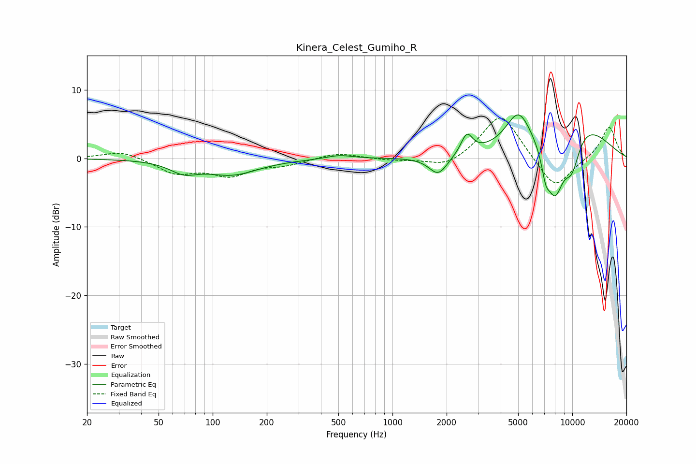

# Kinera_Celest_Gumiho_R
See [usage instructions](https://github.com/jaakkopasanen/AutoEq#usage) for more options and info.

### Parametric EQs
Apply preamp of -6.5 dB when using parametric equalizer.

|   # | Type    |   Fc (Hz) |    Q |   Gain (dB) |
|-----|---------|-----------|------|-------------|
|   1 | Peaking |        69 | 1.84 |        -1.6 |
|   2 | Peaking |       128 | 0.96 |        -2.2 |
|   3 | Peaking |       507 | 1.87 |         0.6 |
|   4 | Peaking |      1798 | 2.74 |        -2.8 |
|   5 | Peaking |      2590 | 4.41 |         2.9 |
|   6 | Peaking |      5024 | 1.99 |         5.2 |
|   7 | Peaking |      7115 | 6    |        -2.8 |
|   8 | Peaking |      8002 | 2.3  |        -9.7 |
|   9 | Peaking |      9952 | 2.52 |        -5.6 |
|  10 | Peaking |     10000 | 0.61 |         6.7 |

### Fixed Band EQs
When using fixed band (also called graphic) equalizer, apply preamp of **-6.0 dB** (if available) and set gains manually with these parameters.

|   # | Type    |   Fc (Hz) |    Q |   Gain (dB) |
|-----|---------|-----------|------|-------------|
|   1 | Peaking |        31 | 1.41 |         1.2 |
|   2 | Peaking |        62 | 1.41 |        -2.1 |
|   3 | Peaking |       125 | 1.41 |        -2.3 |
|   4 | Peaking |       250 | 1.41 |        -0.8 |
|   5 | Peaking |       500 | 1.41 |         0.9 |
|   6 | Peaking |      1000 | 1.41 |        -0.3 |
|   7 | Peaking |      2000 | 1.41 |        -1.5 |
|   8 | Peaking |      4000 | 1.41 |         6.8 |
|   9 | Peaking |      8000 | 1.41 |        -4.8 |
|  10 | Peaking |     16000 | 1.41 |         4.7 |

### Graphs

