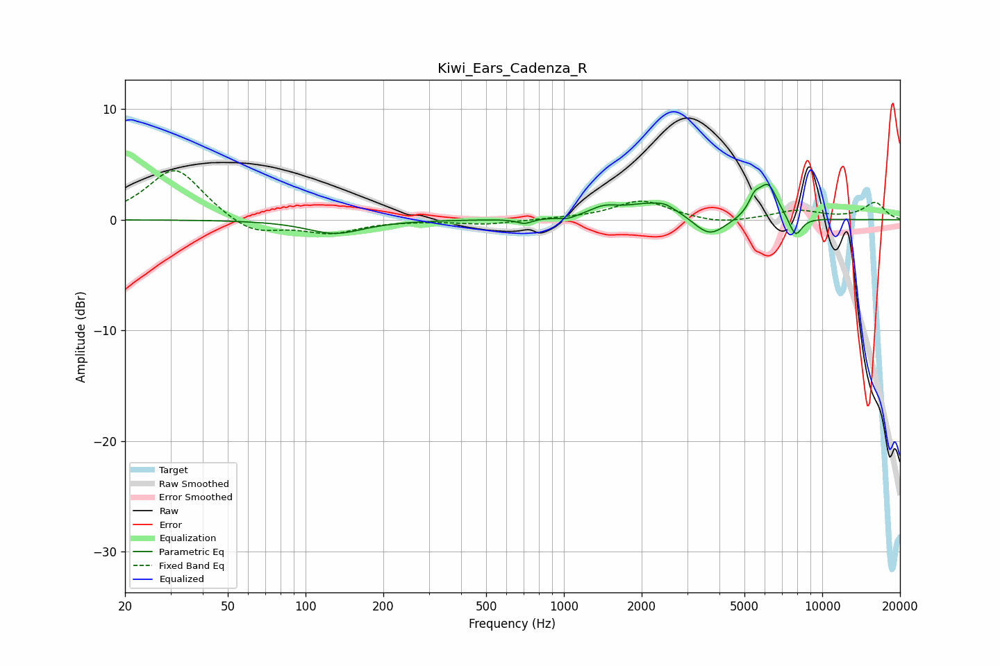

# Kiwi_Ears_Cadenza_R
See [usage instructions](https://github.com/jaakkopasanen/AutoEq#usage) for more options and info.

### Parametric EQs
Apply preamp of -3.3 dB when using parametric equalizer.

|   # | Type    |   Fc (Hz) |    Q |   Gain (dB) |
|-----|---------|-----------|------|-------------|
|   1 | Peaking |       130 | 1.31 |        -1.2 |
|   2 | Peaking |       703 | 5    |        -0.4 |
|   3 | Peaking |      1033 | 4.31 |        -0.3 |
|   4 | Peaking |      1424 | 2.62 |         0.7 |
|   5 | Peaking |      2239 | 1.2  |         1.5 |
|   6 | Peaking |      2462 | 4.55 |         0.3 |
|   7 | Peaking |      3655 | 2.22 |        -1.9 |
|   8 | Peaking |      5465 | 6    |         1.3 |
|   9 | Peaking |      6176 | 3.59 |         3.1 |
|  10 | Peaking |      7878 | 5.18 |        -1.8 |

### Fixed Band EQs
When using fixed band (also called graphic) equalizer, apply preamp of **-4.5 dB** (if available) and set gains manually with these parameters.

|   # | Type    |   Fc (Hz) |    Q |   Gain (dB) |
|-----|---------|-----------|------|-------------|
|   1 | Peaking |        31 | 1.41 |         4.7 |
|   2 | Peaking |        62 | 1.41 |        -1.5 |
|   3 | Peaking |       125 | 1.41 |        -1.2 |
|   4 | Peaking |       250 | 1.41 |        -0   |
|   5 | Peaking |       500 | 1.41 |        -0.4 |
|   6 | Peaking |      1000 | 1.41 |         0.1 |
|   7 | Peaking |      2000 | 1.41 |         1.7 |
|   8 | Peaking |      4000 | 1.41 |        -0.5 |
|   9 | Peaking |      8000 | 1.41 |         0.8 |
|  10 | Peaking |     16000 | 1.41 |         1.5 |

### Graphs

