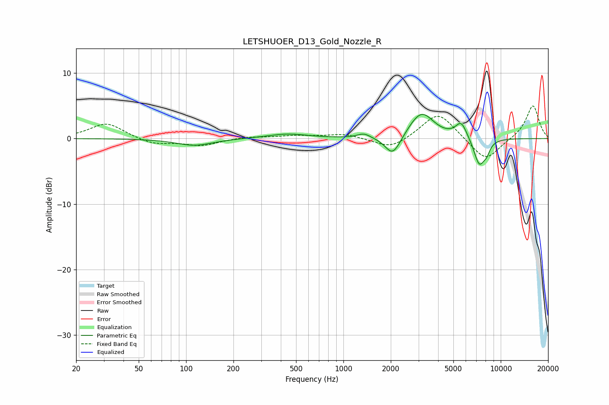

# LETSHUOER_D13_Gold_Nozzle_R
See [usage instructions](https://github.com/jaakkopasanen/AutoEq#usage) for more options and info.

### Parametric EQs
Apply preamp of -3.8 dB when using parametric equalizer.

|   # | Type    |   Fc (Hz) |    Q |   Gain (dB) |
|-----|---------|-----------|------|-------------|
|   1 | Peaking |       113 | 1.22 |        -1.1 |
|   2 | Peaking |       440 | 1.08 |         0.7 |
|   3 | Peaking |      1350 | 3.42 |         0.7 |
|   4 | Peaking |      2048 | 2.97 |        -2.6 |
|   5 | Peaking |      2174 | 2.45 |        -0.6 |
|   6 | Peaking |      2837 | 1.69 |         0.6 |
|   7 | Peaking |      3164 | 1.87 |         3.5 |
|   8 | Peaking |      5612 | 3.79 |         2.4 |
|   9 | Peaking |      7309 | 3.75 |        -4.1 |
|  10 | Peaking |      8134 | 6    |        -1.2 |

### Fixed Band EQs
When using fixed band (also called graphic) equalizer, apply preamp of **-5.1 dB** (if available) and set gains manually with these parameters.

|   # | Type    |   Fc (Hz) |    Q |   Gain (dB) |
|-----|---------|-----------|------|-------------|
|   1 | Peaking |        31 | 1.41 |         2.4 |
|   2 | Peaking |        62 | 1.41 |        -0.9 |
|   3 | Peaking |       125 | 1.41 |        -1   |
|   4 | Peaking |       250 | 1.41 |         0.3 |
|   5 | Peaking |       500 | 1.41 |         0.4 |
|   6 | Peaking |      1000 | 1.41 |         0.7 |
|   7 | Peaking |      2000 | 1.41 |        -1.7 |
|   8 | Peaking |      4000 | 1.41 |         4.1 |
|   9 | Peaking |      8000 | 1.41 |        -3.6 |
|  10 | Peaking |     16000 | 1.41 |         5.1 |

### Graphs

