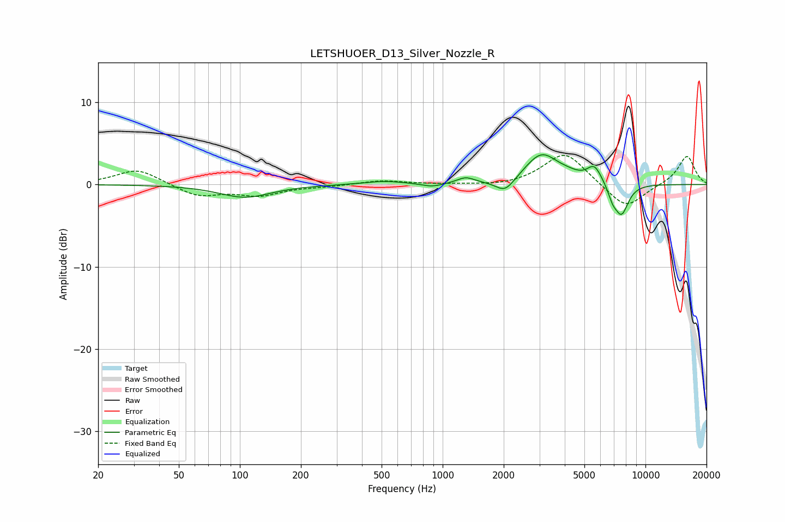

# LETSHUOER_D13_Silver_Nozzle_R
See [usage instructions](https://github.com/jaakkopasanen/AutoEq#usage) for more options and info.

### Parametric EQs
Apply preamp of -3.7 dB when using parametric equalizer.

|   # | Type    |   Fc (Hz) |    Q |   Gain (dB) |
|-----|---------|-----------|------|-------------|
|   1 | Peaking |       106 | 1.12 |        -1.6 |
|   2 | Peaking |       514 | 1.42 |         0.4 |
|   3 | Peaking |       887 | 2.79 |        -0.4 |
|   4 | Peaking |      1300 | 3.3  |         0.7 |
|   5 | Peaking |      2033 | 3    |        -1.7 |
|   6 | Peaking |      3075 | 1.71 |         3.7 |
|   7 | Peaking |      4171 | 2.43 |         0.4 |
|   8 | Peaking |      5604 | 3.75 |         2   |
|   9 | Peaking |      6879 | 6    |        -1.3 |
|  10 | Peaking |      7615 | 3.83 |        -3.7 |

### Fixed Band EQs
When using fixed band (also called graphic) equalizer, apply preamp of **-3.6 dB** (if available) and set gains manually with these parameters.

|   # | Type    |   Fc (Hz) |    Q |   Gain (dB) |
|-----|---------|-----------|------|-------------|
|   1 | Peaking |        31 | 1.41 |         1.9 |
|   2 | Peaking |        62 | 1.41 |        -1.4 |
|   3 | Peaking |       125 | 1.41 |        -1.2 |
|   4 | Peaking |       250 | 1.41 |        -0.2 |
|   5 | Peaking |       500 | 1.41 |         0.5 |
|   6 | Peaking |      1000 | 1.41 |         0   |
|   7 | Peaking |      2000 | 1.41 |        -0.3 |
|   8 | Peaking |      4000 | 1.41 |         4   |
|   9 | Peaking |      8000 | 1.41 |        -3.1 |
|  10 | Peaking |     16000 | 1.41 |         3.5 |

### Graphs

