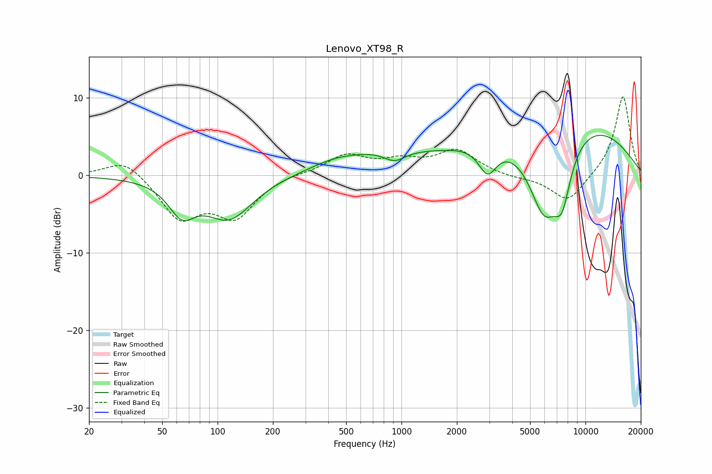

# Lenovo_XT98_R
See [usage instructions](https://github.com/jaakkopasanen/AutoEq#usage) for more options and info.

### Parametric EQs
Apply preamp of -5.3 dB when using parametric equalizer.

|   # | Type    |   Fc (Hz) |    Q |   Gain (dB) |
|-----|---------|-----------|------|-------------|
|   1 | Peaking |        64 | 1.99 |        -3.9 |
|   2 | Peaking |       116 | 1.09 |        -5.4 |
|   3 | Peaking |       426 | 1.05 |         0.8 |
|   4 | Peaking |       767 | 0.56 |         2.3 |
|   5 | Peaking |       904 | 4.48 |         0.1 |
|   6 | Peaking |       915 | 2.58 |        -1.5 |
|   7 | Peaking |      2938 | 2.88 |        -3.7 |
|   8 | Peaking |      5946 | 1.39 |       -11.6 |
|   9 | Peaking |      7207 | 0.31 |         8.7 |
|  10 | Peaking |      7461 | 2.73 |        -6.2 |

### Fixed Band EQs
When using fixed band (also called graphic) equalizer, apply preamp of **-10.2 dB** (if available) and set gains manually with these parameters.

|   # | Type    |   Fc (Hz) |    Q |   Gain (dB) |
|-----|---------|-----------|------|-------------|
|   1 | Peaking |        31 | 1.41 |         2.4 |
|   2 | Peaking |        62 | 1.41 |        -5.4 |
|   3 | Peaking |       125 | 1.41 |        -5   |
|   4 | Peaking |       250 | 1.41 |         0.3 |
|   5 | Peaking |       500 | 1.41 |         2.5 |
|   6 | Peaking |      1000 | 1.41 |         1.6 |
|   7 | Peaking |      2000 | 1.41 |         3.1 |
|   8 | Peaking |      4000 | 1.41 |        -0.3 |
|   9 | Peaking |      8000 | 1.41 |        -3.6 |
|  10 | Peaking |     16000 | 1.41 |        10.4 |

### Graphs

