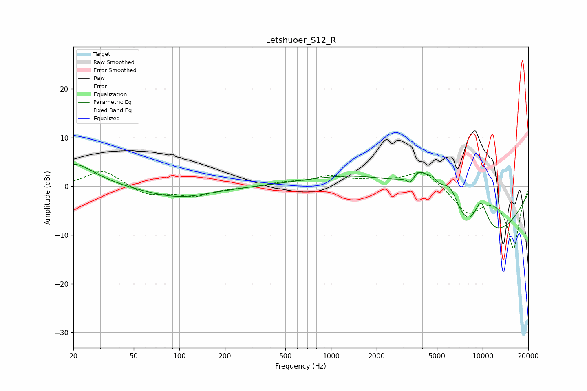

# Letshuoer_S12_R
See [usage instructions](https://github.com/jaakkopasanen/AutoEq#usage) for more options and info.

### Parametric EQs
Apply preamp of -4.6 dB when using parametric equalizer.

|   # | Type    |   Fc (Hz) |    Q |   Gain (dB) |
|-----|---------|-----------|------|-------------|
|   1 | Peaking |        20 | 1.02 |         4.8 |
|   2 | Peaking |        98 | 0.65 |        -2.4 |
|   3 | Peaking |      2372 | 0.36 |         5.1 |
|   4 | Peaking |      3343 | 5.95 |        -1.7 |
|   5 | Peaking |      3873 | 1.85 |         4.7 |
|   6 | Peaking |      4711 | 4.8  |         1.3 |
|   7 | Peaking |      4906 | 0.6  |         2.9 |
|   8 | Peaking |      6111 | 1.94 |         7   |
|   9 | Peaking |      8102 | 0.39 |       -17.1 |
|  10 | Peaking |      9712 | 2.24 |         8.6 |

### Fixed Band EQs
When using fixed band (also called graphic) equalizer, apply preamp of **-3.1 dB** (if available) and set gains manually with these parameters.

|   # | Type    |   Fc (Hz) |    Q |   Gain (dB) |
|-----|---------|-----------|------|-------------|
|   1 | Peaking |        31 | 1.41 |         3.4 |
|   2 | Peaking |        62 | 1.41 |        -1.9 |
|   3 | Peaking |       125 | 1.41 |        -1.9 |
|   4 | Peaking |       250 | 1.41 |        -0.3 |
|   5 | Peaking |       500 | 1.41 |         0.7 |
|   6 | Peaking |      1000 | 1.41 |         1.9 |
|   7 | Peaking |      2000 | 1.41 |         0.9 |
|   8 | Peaking |      4000 | 1.41 |         3.4 |
|   9 | Peaking |      8000 | 1.41 |        -5.2 |
|  10 | Peaking |     16000 | 1.41 |       -12.6 |

### Graphs

