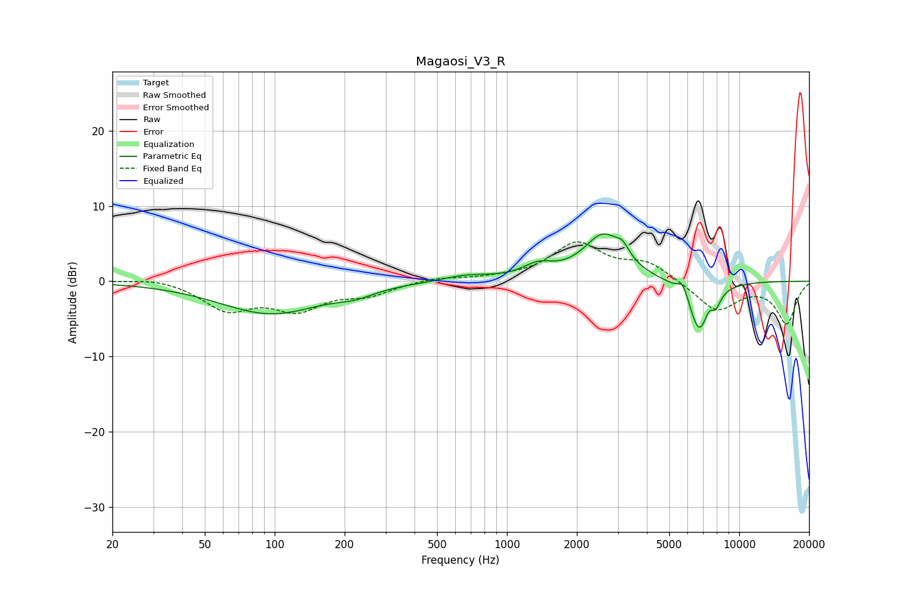

# Magaosi_V3_R
See [usage instructions](https://github.com/jaakkopasanen/AutoEq#usage) for more options and info.

### Parametric EQs
Apply preamp of -6.4 dB when using parametric equalizer.

|   # | Type    |   Fc (Hz) |    Q |   Gain (dB) |
|-----|---------|-----------|------|-------------|
|   1 | Peaking |        96 | 0.64 |        -4.3 |
|   2 | Peaking |       222 | 1.89 |        -0.8 |
|   3 | Peaking |       666 | 1.38 |         0.8 |
|   4 | Peaking |      1362 | 2.15 |         1.6 |
|   5 | Peaking |      2598 | 1.65 |         6   |
|   6 | Peaking |      3151 | 5.15 |         1.4 |
|   7 | Peaking |      5736 | 6    |         1.9 |
|   8 | Peaking |      6766 | 2.89 |        -7.4 |
|   9 | Peaking |      7484 | 4.44 |         2   |
|  10 | Peaking |      7876 | 5.91 |        -2.3 |

### Fixed Band EQs
When using fixed band (also called graphic) equalizer, apply preamp of **-5.3 dB** (if available) and set gains manually with these parameters.

|   # | Type    |   Fc (Hz) |    Q |   Gain (dB) |
|-----|---------|-----------|------|-------------|
|   1 | Peaking |        31 | 1.41 |         0.6 |
|   2 | Peaking |        62 | 1.41 |        -3.6 |
|   3 | Peaking |       125 | 1.41 |        -3.4 |
|   4 | Peaking |       250 | 1.41 |        -1.6 |
|   5 | Peaking |       500 | 1.41 |         0.5 |
|   6 | Peaking |      1000 | 1.41 |         0.3 |
|   7 | Peaking |      2000 | 1.41 |         4.9 |
|   8 | Peaking |      4000 | 1.41 |         2.3 |
|   9 | Peaking |      8000 | 1.41 |        -3.9 |
|  10 | Peaking |     16000 | 1.41 |        -5.5 |

### Graphs

