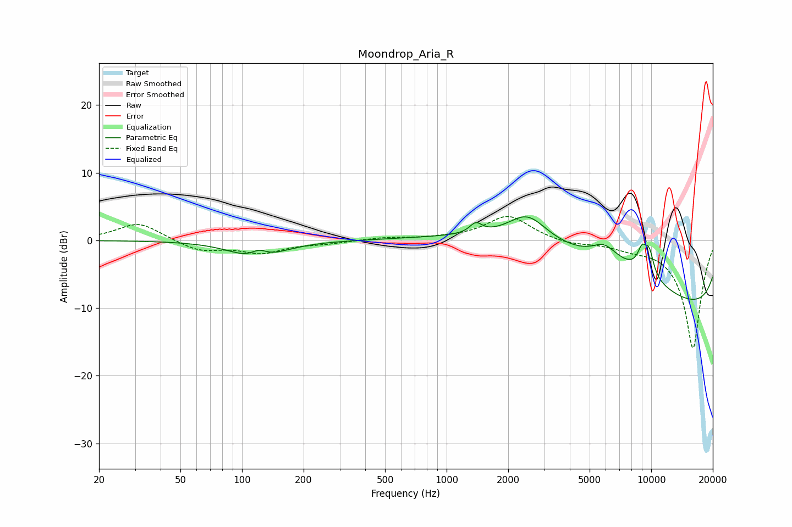

# Moondrop_Aria_R
See [usage instructions](https://github.com/jaakkopasanen/AutoEq#usage) for more options and info.

### Parametric EQs
Apply preamp of -3.6 dB when using parametric equalizer.

|   # | Type    |   Fc (Hz) |    Q |   Gain (dB) |
|-----|---------|-----------|------|-------------|
|   1 | Peaking |       119 | 1.22 |        -2.9 |
|   2 | Peaking |       121 | 3.5  |         1.3 |
|   3 | Peaking |      1389 | 4.78 |         1.5 |
|   4 | Peaking |      2484 | 1.47 |         4.1 |
|   5 | Peaking |      5495 | 0.22 |         9.7 |
|   6 | Peaking |      5889 | 2.31 |         2.1 |
|   7 | Peaking |      7809 | 0.61 |         2.4 |
|   8 | Peaking |      9027 | 5.34 |         3.1 |
|   9 | Peaking |      9788 | 5.57 |         3.3 |
|  10 | Peaking |      9968 | 0.18 |       -16.6 |

### Fixed Band EQs
When using fixed band (also called graphic) equalizer, apply preamp of **-3.6 dB** (if available) and set gains manually with these parameters.

|   # | Type    |   Fc (Hz) |    Q |   Gain (dB) |
|-----|---------|-----------|------|-------------|
|   1 | Peaking |        31 | 1.41 |         2.7 |
|   2 | Peaking |        62 | 1.41 |        -1.6 |
|   3 | Peaking |       125 | 1.41 |        -1.7 |
|   4 | Peaking |       250 | 1.41 |        -0.4 |
|   5 | Peaking |       500 | 1.41 |         0.4 |
|   6 | Peaking |      1000 | 1.41 |         0.2 |
|   7 | Peaking |      2000 | 1.41 |         3.7 |
|   8 | Peaking |      4000 | 1.41 |        -0.6 |
|   9 | Peaking |      8000 | 1.41 |        -0.8 |
|  10 | Peaking |     16000 | 1.41 |       -16   |

### Graphs

