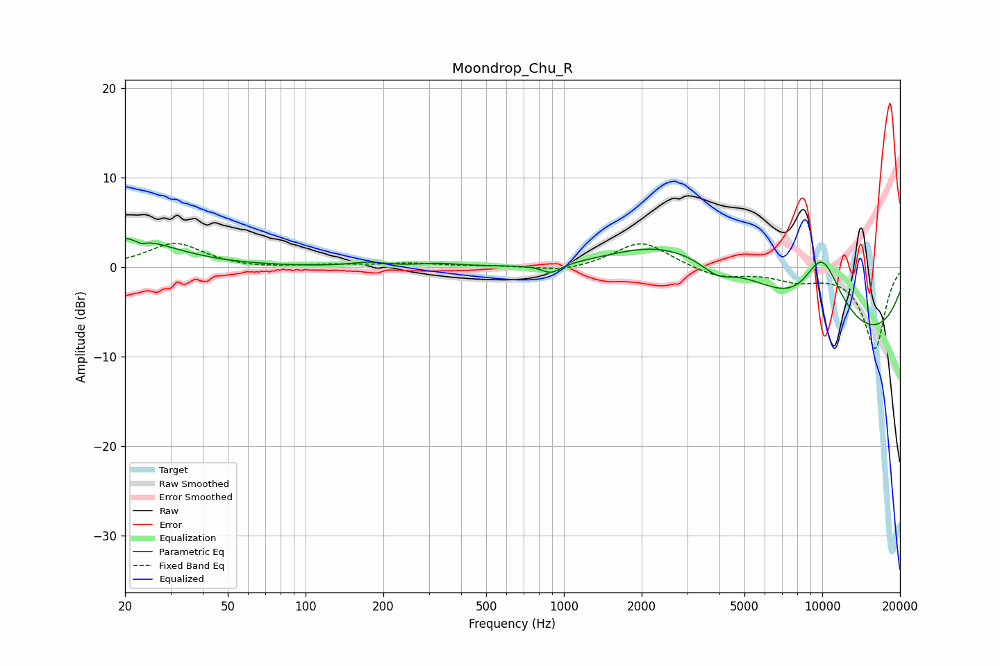

# Moondrop_Chu_R
See [usage instructions](https://github.com/jaakkopasanen/AutoEq#usage) for more options and info.

### Parametric EQs
Apply preamp of -3.3 dB when using parametric equalizer.

|   # | Type    |   Fc (Hz) |    Q |   Gain (dB) |
|-----|---------|-----------|------|-------------|
|   1 | Peaking |        20 | 0.84 |         3.4 |
|   2 | Peaking |        23 | 5.99 |        -0.5 |
|   3 | Peaking |       174 | 2.18 |         0.4 |
|   4 | Peaking |       329 | 1.78 |         0.4 |
|   5 | Peaking |       893 | 3.68 |        -1   |
|   6 | Peaking |      2209 | 0.71 |         2.6 |
|   7 | Peaking |      3917 | 2.12 |        -1.7 |
|   8 | Peaking |      4542 | 0.44 |         8.7 |
|   9 | Peaking |      9127 | 0.34 |       -20   |
|  10 | Peaking |      9938 | 0.97 |        15.6 |

### Fixed Band EQs
When using fixed band (also called graphic) equalizer, apply preamp of **-2.8 dB** (if available) and set gains manually with these parameters.

|   # | Type    |   Fc (Hz) |    Q |   Gain (dB) |
|-----|---------|-----------|------|-------------|
|   1 | Peaking |        31 | 1.41 |         2.7 |
|   2 | Peaking |        62 | 1.41 |        -0.2 |
|   3 | Peaking |       125 | 1.41 |         0.2 |
|   4 | Peaking |       250 | 1.41 |         0.4 |
|   5 | Peaking |       500 | 1.41 |         0.1 |
|   6 | Peaking |      1000 | 1.41 |        -0.6 |
|   7 | Peaking |      2000 | 1.41 |         3   |
|   8 | Peaking |      4000 | 1.41 |        -1.2 |
|   9 | Peaking |      8000 | 1.41 |        -1.2 |
|  10 | Peaking |     16000 | 1.41 |        -9.1 |

### Graphs

