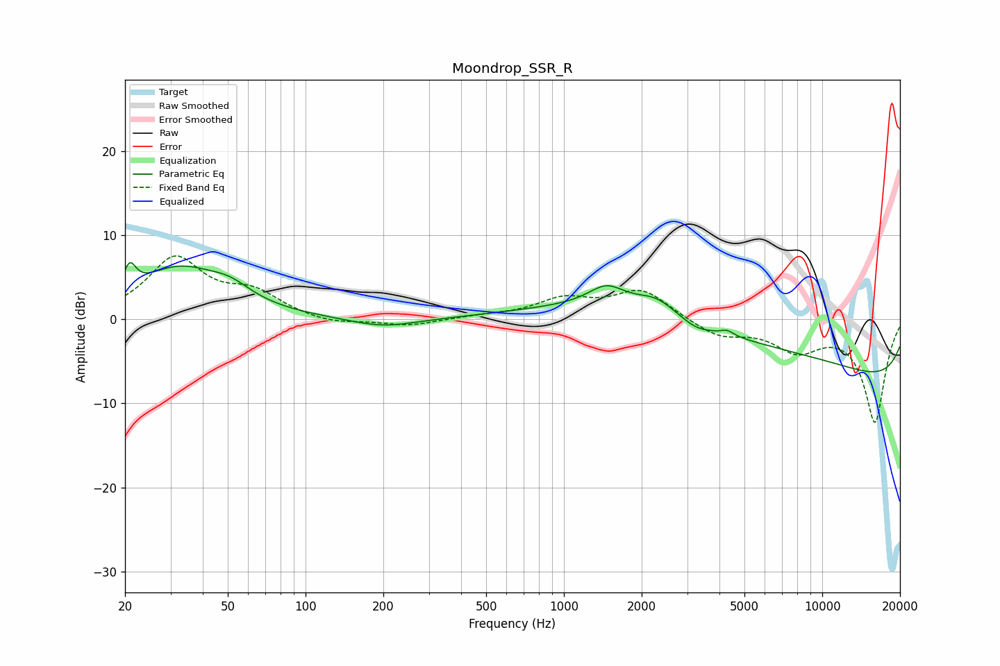

# Moondrop_SSR_R
See [usage instructions](https://github.com/jaakkopasanen/AutoEq#usage) for more options and info.

### Parametric EQs
Apply preamp of -6.8 dB when using parametric equalizer.

|   # | Type    |   Fc (Hz) |    Q |   Gain (dB) |
|-----|---------|-----------|------|-------------|
|   1 | Peaking |        21 | 6    |         2.9 |
|   2 | Peaking |        32 | 0.83 |         5.8 |
|   3 | Peaking |        51 | 1.78 |         1.5 |
|   4 | Peaking |       200 | 1.1  |        -1.1 |
|   5 | Peaking |      1463 | 2.02 |         2.4 |
|   6 | Peaking |      2279 | 1.78 |         1.9 |
|   7 | Peaking |      3246 | 2.35 |        -0.9 |
|   8 | Peaking |      4290 | 5.92 |         0.6 |
|   9 | Peaking |      4640 | 0.22 |         6.3 |
|  10 | Peaking |     10000 | 0.18 |       -10.1 |

### Fixed Band EQs
When using fixed band (also called graphic) equalizer, apply preamp of **-7.6 dB** (if available) and set gains manually with these parameters.

|   # | Type    |   Fc (Hz) |    Q |   Gain (dB) |
|-----|---------|-----------|------|-------------|
|   1 | Peaking |        31 | 1.41 |         7   |
|   2 | Peaking |        62 | 1.41 |         2.7 |
|   3 | Peaking |       125 | 1.41 |        -0.7 |
|   4 | Peaking |       250 | 1.41 |        -0.8 |
|   5 | Peaking |       500 | 1.41 |         0.3 |
|   6 | Peaking |      1000 | 1.41 |         2.2 |
|   7 | Peaking |      2000 | 1.41 |         3.4 |
|   8 | Peaking |      4000 | 1.41 |        -2   |
|   9 | Peaking |      8000 | 1.41 |        -3.3 |
|  10 | Peaking |     16000 | 1.41 |       -12.2 |

### Graphs

