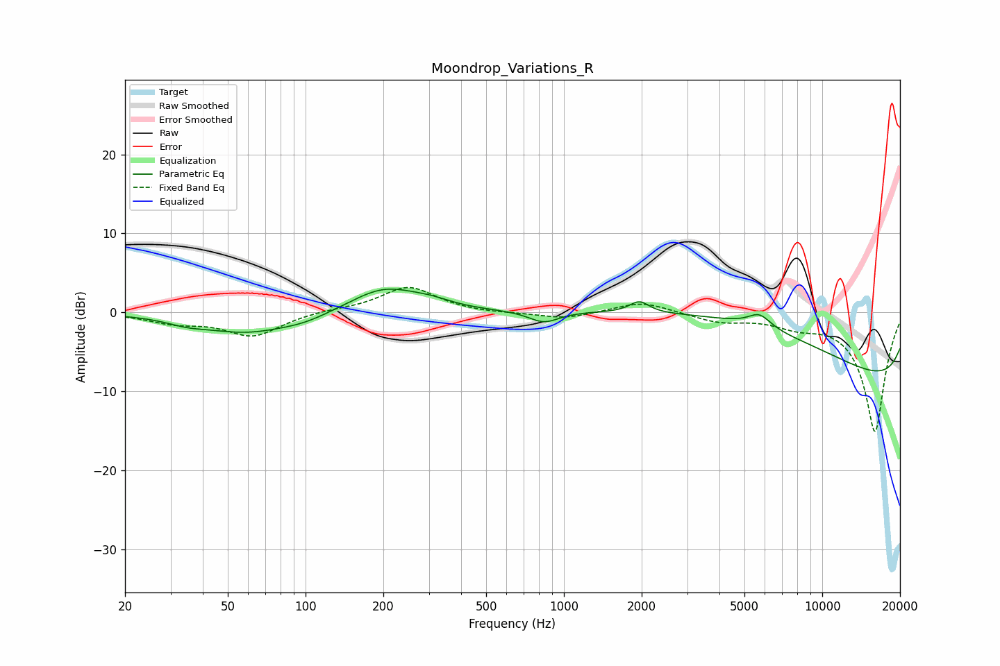

# Moondrop_Variations_R
See [usage instructions](https://github.com/jaakkopasanen/AutoEq#usage) for more options and info.

### Parametric EQs
Apply preamp of -3.1 dB when using parametric equalizer.

|   # | Type    |   Fc (Hz) |    Q |   Gain (dB) |
|-----|---------|-----------|------|-------------|
|   1 | Peaking |        35 | 1.79 |        -0.7 |
|   2 | Peaking |        59 | 0.86 |        -2.4 |
|   3 | Peaking |        99 | 1.34 |        -0.8 |
|   4 | Peaking |       202 | 1.06 |         3.2 |
|   5 | Peaking |       307 | 1.81 |         0.6 |
|   6 | Peaking |       837 | 2.41 |        -1.5 |
|   7 | Peaking |      1957 | 3.83 |         1.4 |
|   8 | Peaking |      5719 | 3.11 |         1.7 |
|   9 | Peaking |      6143 | 0.26 |        11.3 |
|  10 | Peaking |     10000 | 0.18 |       -14.8 |

### Fixed Band EQs
When using fixed band (also called graphic) equalizer, apply preamp of **-3.3 dB** (if available) and set gains manually with these parameters.

|   # | Type    |   Fc (Hz) |    Q |   Gain (dB) |
|-----|---------|-----------|------|-------------|
|   1 | Peaking |        31 | 1.41 |        -1.1 |
|   2 | Peaking |        62 | 1.41 |        -2.9 |
|   3 | Peaking |       125 | 1.41 |         0.3 |
|   4 | Peaking |       250 | 1.41 |         3.3 |
|   5 | Peaking |       500 | 1.41 |        -0.2 |
|   6 | Peaking |      1000 | 1.41 |        -0.8 |
|   7 | Peaking |      2000 | 1.41 |         1.4 |
|   8 | Peaking |      4000 | 1.41 |        -1.1 |
|   9 | Peaking |      8000 | 1.41 |        -1.3 |
|  10 | Peaking |     16000 | 1.41 |       -15.1 |

### Graphs

