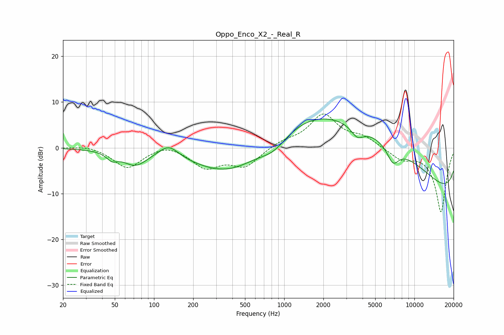

# Oppo_Enco_X2_-_Real_R
See [usage instructions](https://github.com/jaakkopasanen/AutoEq#usage) for more options and info.

### Parametric EQs
Apply preamp of -6.4 dB when using parametric equalizer.

|   # | Type    |   Fc (Hz) |    Q |   Gain (dB) |
|-----|---------|-----------|------|-------------|
|   1 | Peaking |        48 | 3.43 |        -1.6 |
|   2 | Peaking |        72 | 1.52 |        -3.3 |
|   3 | Peaking |       130 | 1.83 |         2.8 |
|   4 | Peaking |       402 | 0.49 |        -7.2 |
|   5 | Peaking |       835 | 1.3  |        -3.1 |
|   6 | Peaking |      3400 | 0.18 |         9.6 |
|   7 | Peaking |      3644 | 2.96 |        -2.4 |
|   8 | Peaking |      4282 | 0.22 |         7.3 |
|   9 | Peaking |      6839 | 2.91 |        -3.8 |
|  10 | Peaking |     10000 | 0.18 |       -15.5 |

### Fixed Band EQs
When using fixed band (also called graphic) equalizer, apply preamp of **-7.5 dB** (if available) and set gains manually with these parameters.

|   # | Type    |   Fc (Hz) |    Q |   Gain (dB) |
|-----|---------|-----------|------|-------------|
|   1 | Peaking |        31 | 1.41 |         0.6 |
|   2 | Peaking |        62 | 1.41 |        -4.4 |
|   3 | Peaking |       125 | 1.41 |         1.2 |
|   4 | Peaking |       250 | 1.41 |        -4.1 |
|   5 | Peaking |       500 | 1.41 |        -3.9 |
|   6 | Peaking |      1000 | 1.41 |         1.3 |
|   7 | Peaking |      2000 | 1.41 |         7.1 |
|   8 | Peaking |      4000 | 1.41 |         2   |
|   9 | Peaking |      8000 | 1.41 |        -2.3 |
|  10 | Peaking |     16000 | 1.41 |       -14   |

### Graphs

