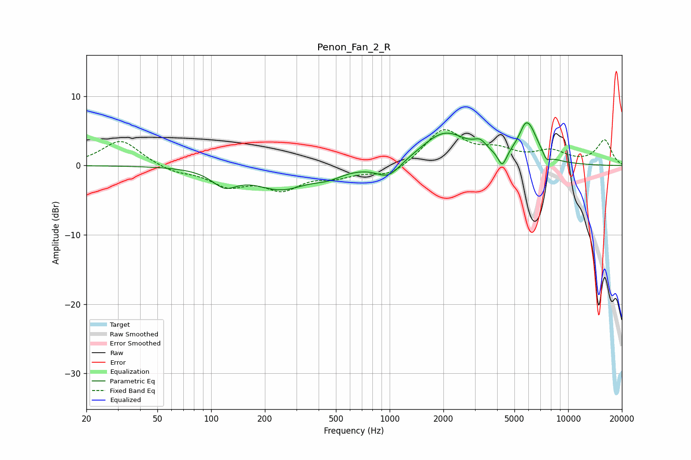

# Penon_Fan_2_R
See [usage instructions](https://github.com/jaakkopasanen/AutoEq#usage) for more options and info.

### Parametric EQs
Apply preamp of -6.3 dB when using parametric equalizer.

|   # | Type    |   Fc (Hz) |    Q |   Gain (dB) |
|-----|---------|-----------|------|-------------|
|   1 | Peaking |       119 | 2.02 |        -2.3 |
|   2 | Peaking |       246 | 0.95 |        -3.2 |
|   3 | Peaking |       452 | 1.73 |        -1   |
|   4 | Peaking |       986 | 2.08 |        -2.2 |
|   5 | Peaking |      2041 | 1.06 |         4.7 |
|   6 | Peaking |      3213 | 4    |         1.3 |
|   7 | Peaking |      4275 | 5.95 |        -2.3 |
|   8 | Peaking |      5707 | 5.98 |         0.6 |
|   9 | Peaking |      5970 | 2.53 |         5.3 |
|  10 | Peaking |      7563 | 6    |        -1.1 |

### Fixed Band EQs
When using fixed band (also called graphic) equalizer, apply preamp of **-5.3 dB** (if available) and set gains manually with these parameters.

|   # | Type    |   Fc (Hz) |    Q |   Gain (dB) |
|-----|---------|-----------|------|-------------|
|   1 | Peaking |        31 | 1.41 |         3.7 |
|   2 | Peaking |        62 | 1.41 |        -0.9 |
|   3 | Peaking |       125 | 1.41 |        -2.6 |
|   4 | Peaking |       250 | 1.41 |        -3   |
|   5 | Peaking |       500 | 1.41 |        -1.3 |
|   6 | Peaking |      1000 | 1.41 |        -1.6 |
|   7 | Peaking |      2000 | 1.41 |         5.2 |
|   8 | Peaking |      4000 | 1.41 |         1.8 |
|   9 | Peaking |      8000 | 1.41 |         1.8 |
|  10 | Peaking |     16000 | 1.41 |         3.6 |

### Graphs

