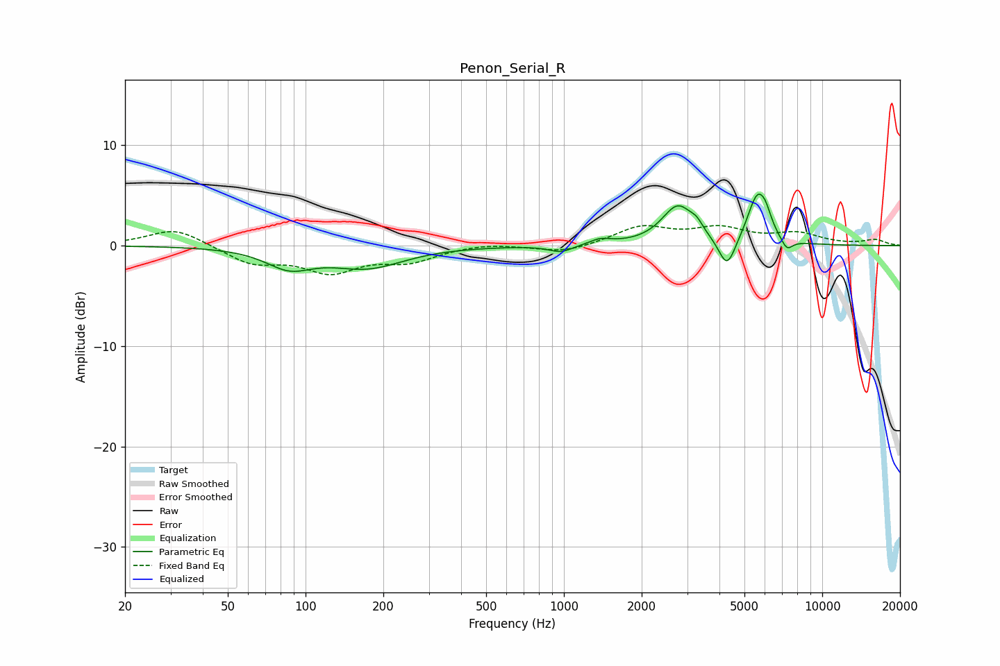

# Penon_Serial_R
See [usage instructions](https://github.com/jaakkopasanen/AutoEq#usage) for more options and info.

### Parametric EQs
Apply preamp of -5.2 dB when using parametric equalizer.

|   # | Type    |   Fc (Hz) |    Q |   Gain (dB) |
|-----|---------|-----------|------|-------------|
|   1 | Peaking |        86 | 1.58 |        -1.9 |
|   2 | Peaking |       173 | 0.99 |        -2.1 |
|   3 | Peaking |       975 | 3.05 |        -0.7 |
|   4 | Peaking |      1383 | 3.31 |         0.5 |
|   5 | Peaking |      2764 | 2.29 |         3.9 |
|   6 | Peaking |      3270 | 6    |         0.7 |
|   7 | Peaking |      4284 | 4.29 |        -3.1 |
|   8 | Peaking |      5597 | 3.64 |         4.6 |
|   9 | Peaking |      6041 | 5.94 |         1.3 |
|  10 | Peaking |      7298 | 6    |        -1.1 |

### Fixed Band EQs
When using fixed band (also called graphic) equalizer, apply preamp of **-2.1 dB** (if available) and set gains manually with these parameters.

|   # | Type    |   Fc (Hz) |    Q |   Gain (dB) |
|-----|---------|-----------|------|-------------|
|   1 | Peaking |        31 | 1.41 |         1.8 |
|   2 | Peaking |        62 | 1.41 |        -1.7 |
|   3 | Peaking |       125 | 1.41 |        -2.4 |
|   4 | Peaking |       250 | 1.41 |        -1.4 |
|   5 | Peaking |       500 | 1.41 |         0.3 |
|   6 | Peaking |      1000 | 1.41 |        -0.8 |
|   7 | Peaking |      2000 | 1.41 |         1.8 |
|   8 | Peaking |      4000 | 1.41 |         1.5 |
|   9 | Peaking |      8000 | 1.41 |         1.1 |
|  10 | Peaking |     16000 | 1.41 |         0.6 |

### Graphs

