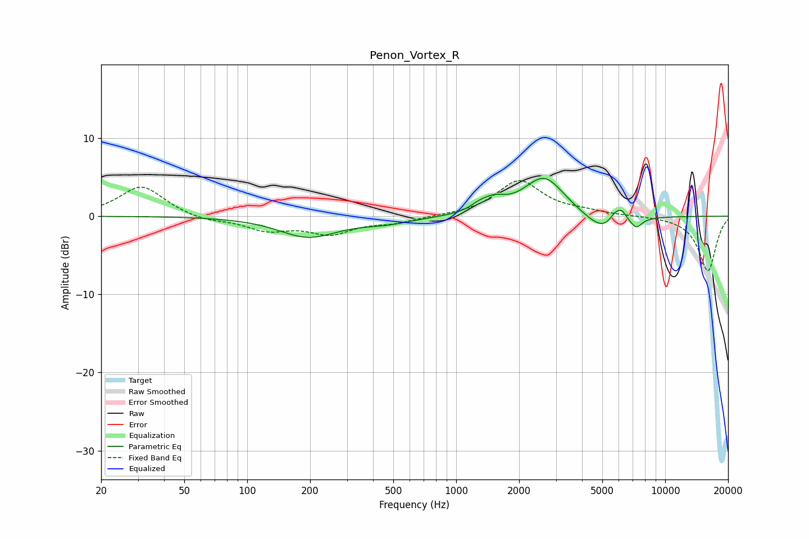

# Penon_Vortex_R
See [usage instructions](https://github.com/jaakkopasanen/AutoEq#usage) for more options and info.

### Parametric EQs
Apply preamp of -4.9 dB when using parametric equalizer.

|   # | Type    |   Fc (Hz) |    Q |   Gain (dB) |
|-----|---------|-----------|------|-------------|
|   1 | Peaking |       194 | 1.03 |        -2.5 |
|   2 | Peaking |       419 | 0.62 |        -0.4 |
|   3 | Peaking |       468 | 1.45 |        -0.4 |
|   4 | Peaking |      1288 | 3.28 |         0.6 |
|   5 | Peaking |      1514 | 2.51 |         1.4 |
|   6 | Peaking |      2637 | 1.44 |         5.1 |
|   7 | Peaking |      5146 | 1.54 |        -2.5 |
|   8 | Peaking |      5751 | 4.72 |         1.5 |
|   9 | Peaking |      6210 | 5.96 |         1.3 |
|  10 | Peaking |      7286 | 5.31 |        -1.1 |

### Fixed Band EQs
When using fixed band (also called graphic) equalizer, apply preamp of **-4.6 dB** (if available) and set gains manually with these parameters.

|   # | Type    |   Fc (Hz) |    Q |   Gain (dB) |
|-----|---------|-----------|------|-------------|
|   1 | Peaking |        31 | 1.41 |         3.9 |
|   2 | Peaking |        62 | 1.41 |        -0.6 |
|   3 | Peaking |       125 | 1.41 |        -1.7 |
|   4 | Peaking |       250 | 1.41 |        -2.1 |
|   5 | Peaking |       500 | 1.41 |        -0.7 |
|   6 | Peaking |      1000 | 1.41 |         0   |
|   7 | Peaking |      2000 | 1.41 |         4.5 |
|   8 | Peaking |      4000 | 1.41 |         0.5 |
|   9 | Peaking |      8000 | 1.41 |         0   |
|  10 | Peaking |     16000 | 1.41 |        -7   |

### Graphs

