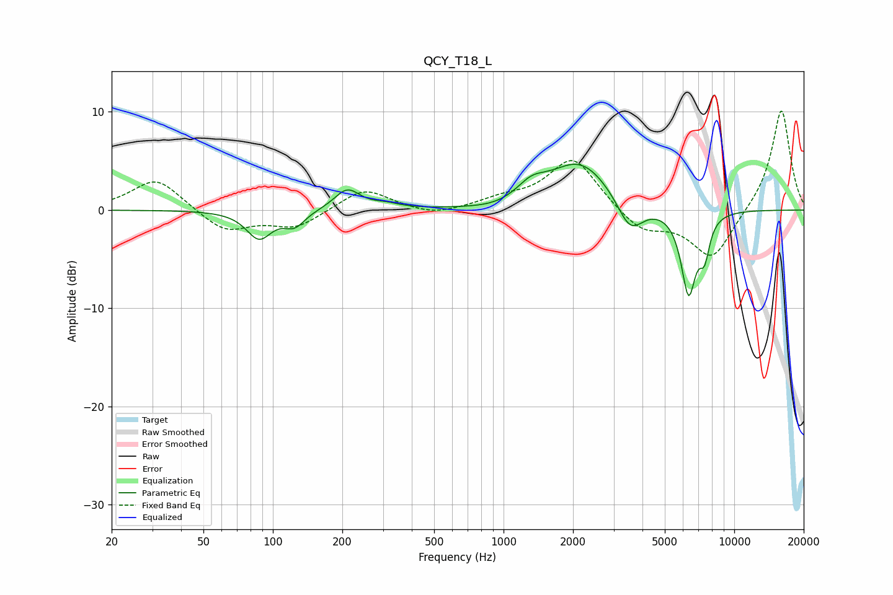

# QCY_T18_L
See [usage instructions](https://github.com/jaakkopasanen/AutoEq#usage) for more options and info.

### Parametric EQs
Apply preamp of -4.8 dB when using parametric equalizer.

|   # | Type    |   Fc (Hz) |    Q |   Gain (dB) |
|-----|---------|-----------|------|-------------|
|   1 | Peaking |        87 | 2.63 |        -2.8 |
|   2 | Peaking |       124 | 3.14 |        -1.5 |
|   3 | Peaking |       210 | 2.55 |         2.1 |
|   4 | Peaking |       309 | 2.34 |         0.4 |
|   5 | Peaking |       941 | 1.26 |        -0.5 |
|   6 | Peaking |      1317 | 2.23 |         1.5 |
|   7 | Peaking |      2146 | 1.02 |         4.9 |
|   8 | Peaking |      3536 | 2.44 |        -3.4 |
|   9 | Peaking |      6340 | 4.17 |        -8.4 |
|  10 | Peaking |      7428 | 6    |        -3.4 |

### Fixed Band EQs
When using fixed band (also called graphic) equalizer, apply preamp of **-10.2 dB** (if available) and set gains manually with these parameters.

|   # | Type    |   Fc (Hz) |    Q |   Gain (dB) |
|-----|---------|-----------|------|-------------|
|   1 | Peaking |        31 | 1.41 |         3.3 |
|   2 | Peaking |        62 | 1.41 |        -2.3 |
|   3 | Peaking |       125 | 1.41 |        -1.8 |
|   4 | Peaking |       250 | 1.41 |         2.3 |
|   5 | Peaking |       500 | 1.41 |        -0.7 |
|   6 | Peaking |      1000 | 1.41 |         0.9 |
|   7 | Peaking |      2000 | 1.41 |         5.4 |
|   8 | Peaking |      4000 | 1.41 |        -2.2 |
|   9 | Peaking |      8000 | 1.41 |        -5   |
|  10 | Peaking |     16000 | 1.41 |        10.4 |

### Graphs

