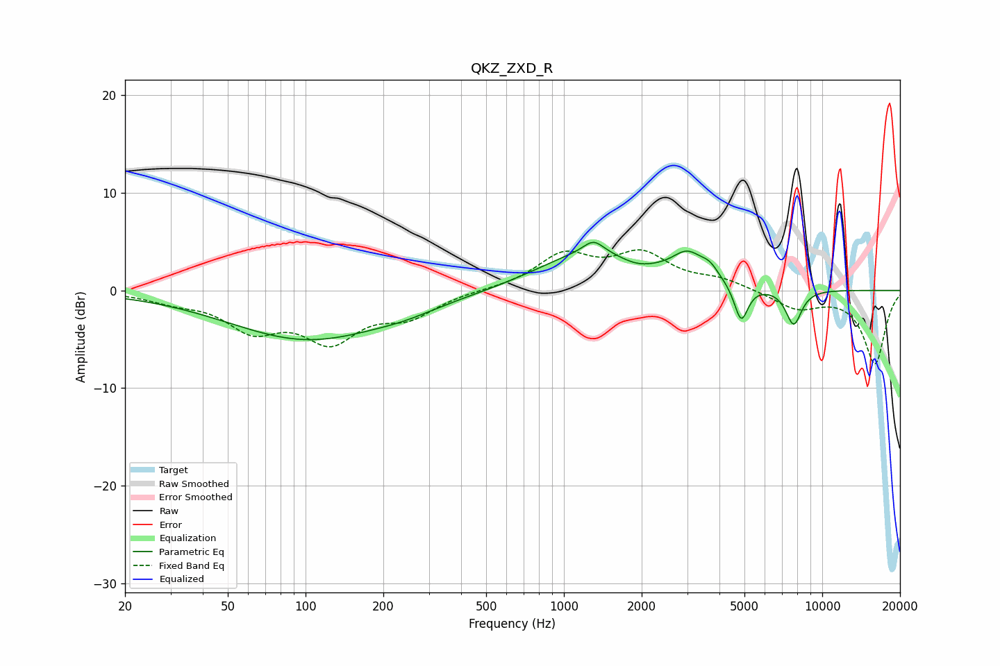

# QKZ_ZXD_R
See [usage instructions](https://github.com/jaakkopasanen/AutoEq#usage) for more options and info.

### Parametric EQs
Apply preamp of -5.0 dB when using parametric equalizer.

|   # | Type    |   Fc (Hz) |    Q |   Gain (dB) |
|-----|---------|-----------|------|-------------|
|   1 | Peaking |       102 | 0.46 |        -5   |
|   2 | Peaking |       244 | 1.16 |        -0.6 |
|   3 | Peaking |       903 | 0.49 |        -1.4 |
|   4 | Peaking |      1225 | 0.59 |         5.2 |
|   5 | Peaking |      1302 | 3.66 |         1.3 |
|   6 | Peaking |      1911 | 2.02 |        -0.7 |
|   7 | Peaking |      3009 | 2.42 |         2.4 |
|   8 | Peaking |      3666 | 3.94 |         1.1 |
|   9 | Peaking |      4854 | 5.16 |        -3.8 |
|  10 | Peaking |      7754 | 4.29 |        -3.7 |

### Fixed Band EQs
When using fixed band (also called graphic) equalizer, apply preamp of **-4.2 dB** (if available) and set gains manually with these parameters.

|   # | Type    |   Fc (Hz) |    Q |   Gain (dB) |
|-----|---------|-----------|------|-------------|
|   1 | Peaking |        31 | 1.41 |        -0.9 |
|   2 | Peaking |        62 | 1.41 |        -3.6 |
|   3 | Peaking |       125 | 1.41 |        -4.7 |
|   4 | Peaking |       250 | 1.41 |        -2.3 |
|   5 | Peaking |       500 | 1.41 |         0   |
|   6 | Peaking |      1000 | 1.41 |         3.5 |
|   7 | Peaking |      2000 | 1.41 |         3.4 |
|   8 | Peaking |      4000 | 1.41 |         1   |
|   9 | Peaking |      8000 | 1.41 |        -1.8 |
|  10 | Peaking |     16000 | 1.41 |        -7.5 |

### Graphs

