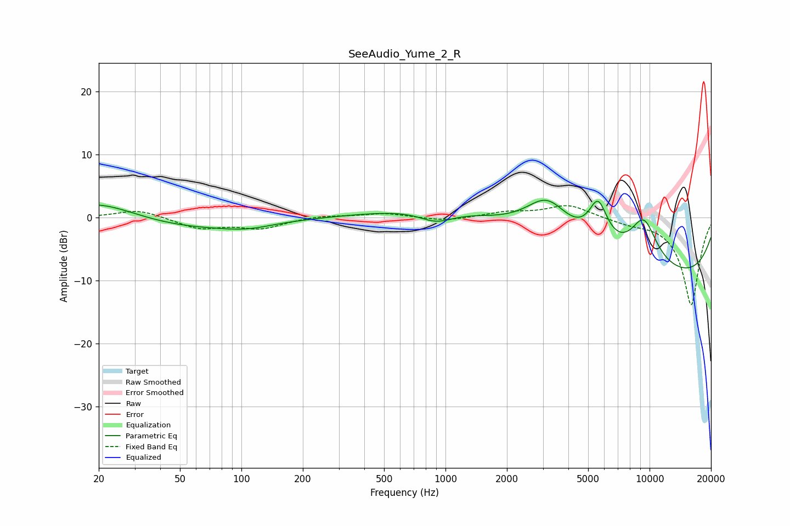

# SeeAudio_Yume_2_R
See [usage instructions](https://github.com/jaakkopasanen/AutoEq#usage) for more options and info.

### Parametric EQs
Apply preamp of -2.9 dB when using parametric equalizer.

|   # | Type    |   Fc (Hz) |    Q |   Gain (dB) |
|-----|---------|-----------|------|-------------|
|   1 | Peaking |        20 | 0.76 |         2.8 |
|   2 | Peaking |        54 | 0.46 |        -1.7 |
|   3 | Peaking |       107 | 1.14 |        -0.8 |
|   4 | Peaking |       900 | 1.65 |        -1.9 |
|   5 | Peaking |      3151 | 1.27 |         6.5 |
|   6 | Peaking |      4236 | 0.18 |         8.6 |
|   7 | Peaking |      5595 | 2.93 |         6.6 |
|   8 | Peaking |      7662 | 0.18 |        -4.6 |
|   9 | Peaking |      8159 | 0.18 |       -11.2 |
|  10 | Peaking |      9361 | 1.85 |         7.1 |

### Fixed Band EQs
When using fixed band (also called graphic) equalizer, apply preamp of **-2.0 dB** (if available) and set gains manually with these parameters.

|   # | Type    |   Fc (Hz) |    Q |   Gain (dB) |
|-----|---------|-----------|------|-------------|
|   1 | Peaking |        31 | 1.41 |         1.3 |
|   2 | Peaking |        62 | 1.41 |        -1.7 |
|   3 | Peaking |       125 | 1.41 |        -1.6 |
|   4 | Peaking |       250 | 1.41 |         0.4 |
|   5 | Peaking |       500 | 1.41 |         0.7 |
|   6 | Peaking |      1000 | 1.41 |        -0.6 |
|   7 | Peaking |      2000 | 1.41 |         0.8 |
|   8 | Peaking |      4000 | 1.41 |         2   |
|   9 | Peaking |      8000 | 1.41 |        -0.7 |
|  10 | Peaking |     16000 | 1.41 |       -13.9 |

### Graphs

