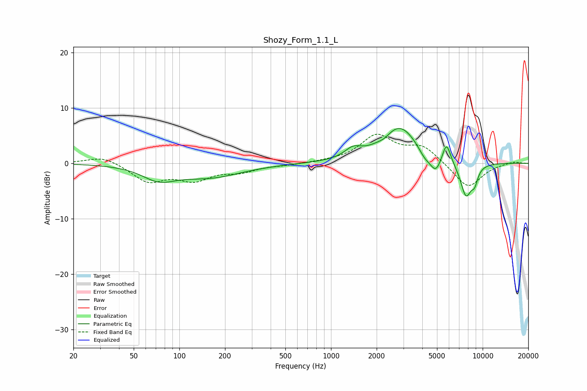

# Shozy_Form_1.1_L
See [usage instructions](https://github.com/jaakkopasanen/AutoEq#usage) for more options and info.

### Parametric EQs
Apply preamp of -6.4 dB when using parametric equalizer.

|   # | Type    |   Fc (Hz) |    Q |   Gain (dB) |
|-----|---------|-----------|------|-------------|
|   1 | Peaking |        73 | 1.31 |        -2.4 |
|   2 | Peaking |       158 | 0.67 |        -2.4 |
|   3 | Peaking |      1394 | 2.61 |         1.6 |
|   4 | Peaking |      2252 | 3.61 |        -0.6 |
|   5 | Peaking |      2830 | 1.16 |         6.7 |
|   6 | Peaking |      4149 | 3.32 |        -1.5 |
|   7 | Peaking |      4904 | 3.74 |        -3   |
|   8 | Peaking |      5772 | 5.03 |         3.8 |
|   9 | Peaking |      7768 | 3.43 |        -6.2 |
|  10 | Peaking |      8853 | 5.97 |        -2.3 |

### Fixed Band EQs
When using fixed band (also called graphic) equalizer, apply preamp of **-5.3 dB** (if available) and set gains manually with these parameters.

|   # | Type    |   Fc (Hz) |    Q |   Gain (dB) |
|-----|---------|-----------|------|-------------|
|   1 | Peaking |        31 | 1.41 |         1.4 |
|   2 | Peaking |        62 | 1.41 |        -3.2 |
|   3 | Peaking |       125 | 1.41 |        -2.7 |
|   4 | Peaking |       250 | 1.41 |        -1.3 |
|   5 | Peaking |       500 | 1.41 |        -0.3 |
|   6 | Peaking |      1000 | 1.41 |         0.2 |
|   7 | Peaking |      2000 | 1.41 |         4.8 |
|   8 | Peaking |      4000 | 1.41 |         2.9 |
|   9 | Peaking |      8000 | 1.41 |        -4.6 |
|  10 | Peaking |     16000 | 1.41 |         0.4 |

### Graphs

