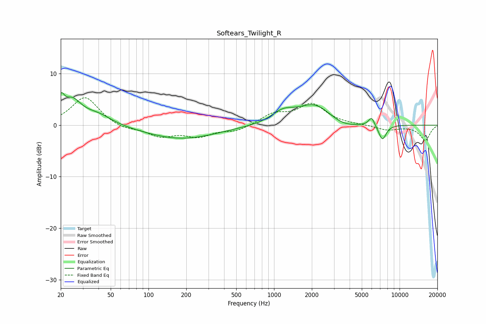

# Softears_Twilight_R
See [usage instructions](https://github.com/jaakkopasanen/AutoEq#usage) for more options and info.

### Parametric EQs
Apply preamp of -6.4 dB when using parametric equalizer.

|   # | Type    |   Fc (Hz) |    Q |   Gain (dB) |
|-----|---------|-----------|------|-------------|
|   1 | Peaking |        20 | 5.99 |         3.1 |
|   2 | Peaking |        25 | 1.87 |         4.4 |
|   3 | Peaking |        40 | 1.25 |         1.9 |
|   4 | Peaking |       182 | 0.5  |        -2.7 |
|   5 | Peaking |      1175 | 1.6  |         2.1 |
|   6 | Peaking |      2104 | 1.03 |         4   |
|   7 | Peaking |      3537 | 1.27 |        -1.2 |
|   8 | Peaking |      5710 | 4.55 |         0   |
|   9 | Peaking |      5989 | 5.83 |         1.7 |
|  10 | Peaking |      7295 | 4.36 |        -2.9 |

### Fixed Band EQs
When using fixed band (also called graphic) equalizer, apply preamp of **-5.4 dB** (if available) and set gains manually with these parameters.

|   # | Type    |   Fc (Hz) |    Q |   Gain (dB) |
|-----|---------|-----------|------|-------------|
|   1 | Peaking |        31 | 1.41 |         5.6 |
|   2 | Peaking |        62 | 1.41 |        -0.9 |
|   3 | Peaking |       125 | 1.41 |        -2   |
|   4 | Peaking |       250 | 1.41 |        -2   |
|   5 | Peaking |       500 | 1.41 |        -1.1 |
|   6 | Peaking |      1000 | 1.41 |         2   |
|   7 | Peaking |      2000 | 1.41 |         3.9 |
|   8 | Peaking |      4000 | 1.41 |         0.1 |
|   9 | Peaking |      8000 | 1.41 |        -0.9 |
|  10 | Peaking |     16000 | 1.41 |        -2.9 |

### Graphs

