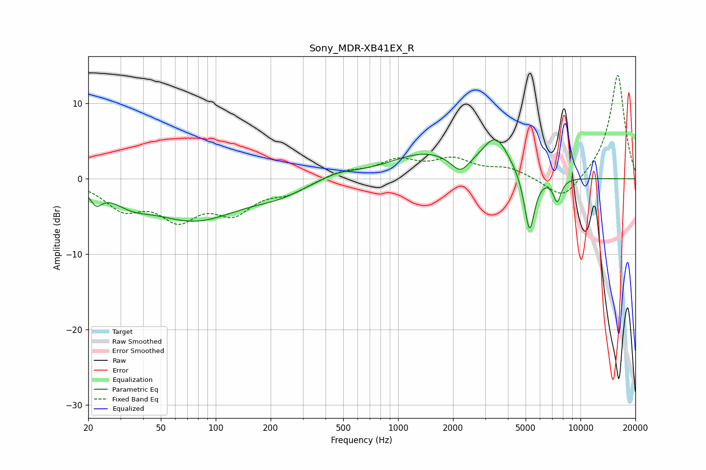

# Sony_MDR-XB41EX_R
See [usage instructions](https://github.com/jaakkopasanen/AutoEq#usage) for more options and info.

### Parametric EQs
Apply preamp of -5.3 dB when using parametric equalizer.

|   # | Type    |   Fc (Hz) |    Q |   Gain (dB) |
|-----|---------|-----------|------|-------------|
|   1 | Peaking |        22 | 4.65 |        -1.8 |
|   2 | Peaking |        35 | 1.46 |        -1.5 |
|   3 | Peaking |        77 | 0.55 |        -5.3 |
|   4 | Peaking |       225 | 0.98 |        -1.2 |
|   5 | Peaking |       468 | 1.35 |         0.9 |
|   6 | Peaking |      1416 | 0.7  |         3.3 |
|   7 | Peaking |      2192 | 2.86 |        -2.1 |
|   8 | Peaking |      3435 | 1.88 |         4.8 |
|   9 | Peaking |      5255 | 4.78 |        -8   |
|  10 | Peaking |      7454 | 5.97 |        -3   |

### Fixed Band EQs
When using fixed band (also called graphic) equalizer, apply preamp of **-13.8 dB** (if available) and set gains manually with these parameters.

|   # | Type    |   Fc (Hz) |    Q |   Gain (dB) |
|-----|---------|-----------|------|-------------|
|   1 | Peaking |        31 | 1.41 |        -3.5 |
|   2 | Peaking |        62 | 1.41 |        -4.6 |
|   3 | Peaking |       125 | 1.41 |        -3.9 |
|   4 | Peaking |       250 | 1.41 |        -1.6 |
|   5 | Peaking |       500 | 1.41 |         1   |
|   6 | Peaking |      1000 | 1.41 |         2.2 |
|   7 | Peaking |      2000 | 1.41 |         2.3 |
|   8 | Peaking |      4000 | 1.41 |         1.3 |
|   9 | Peaking |      8000 | 1.41 |        -3.1 |
|  10 | Peaking |     16000 | 1.41 |        14   |

### Graphs

