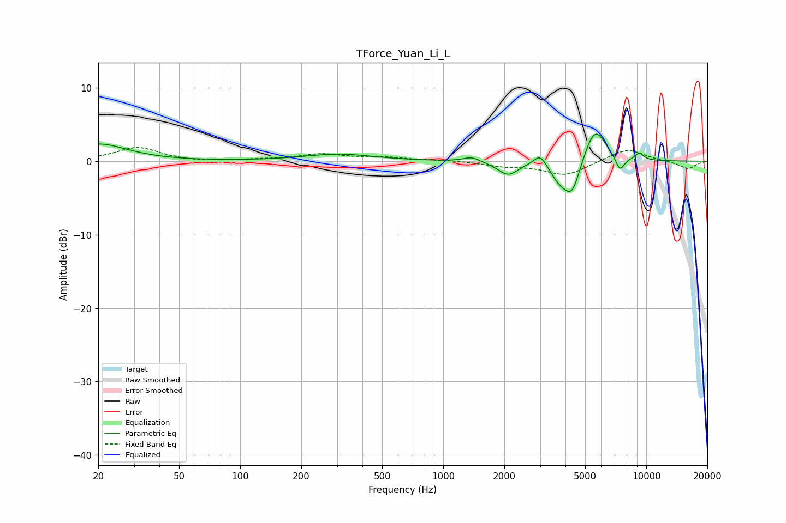

# TForce_Yuan_Li_L
See [usage instructions](https://github.com/jaakkopasanen/AutoEq#usage) for more options and info.

### Parametric EQs
Apply preamp of -3.8 dB when using parametric equalizer.

|   # | Type    |   Fc (Hz) |    Q |   Gain (dB) |
|-----|---------|-----------|------|-------------|
|   1 | Peaking |        20 | 1    |         2.3 |
|   2 | Peaking |       305 | 0.83 |         0.9 |
|   3 | Peaking |      1380 | 3.53 |         0.7 |
|   4 | Peaking |      2084 | 2.82 |        -1.9 |
|   5 | Peaking |      2999 | 4.6  |         1.6 |
|   6 | Peaking |      3718 | 3.22 |        -2   |
|   7 | Peaking |      4308 | 3.39 |        -4.5 |
|   8 | Peaking |      5586 | 2.54 |         4.9 |
|   9 | Peaking |      7420 | 5.89 |        -2   |
|  10 | Peaking |      9240 | 6    |         1   |

### Fixed Band EQs
When using fixed band (also called graphic) equalizer, apply preamp of **-1.9 dB** (if available) and set gains manually with these parameters.

|   # | Type    |   Fc (Hz) |    Q |   Gain (dB) |
|-----|---------|-----------|------|-------------|
|   1 | Peaking |        31 | 1.41 |         1.9 |
|   2 | Peaking |        62 | 1.41 |        -0.2 |
|   3 | Peaking |       125 | 1.41 |         0.2 |
|   4 | Peaking |       250 | 1.41 |         0.9 |
|   5 | Peaking |       500 | 1.41 |         0.5 |
|   6 | Peaking |      1000 | 1.41 |         0.2 |
|   7 | Peaking |      2000 | 1.41 |        -0.6 |
|   8 | Peaking |      4000 | 1.41 |        -1.9 |
|   9 | Peaking |      8000 | 1.41 |         1.8 |
|  10 | Peaking |     16000 | 1.41 |        -1.1 |

### Graphs

