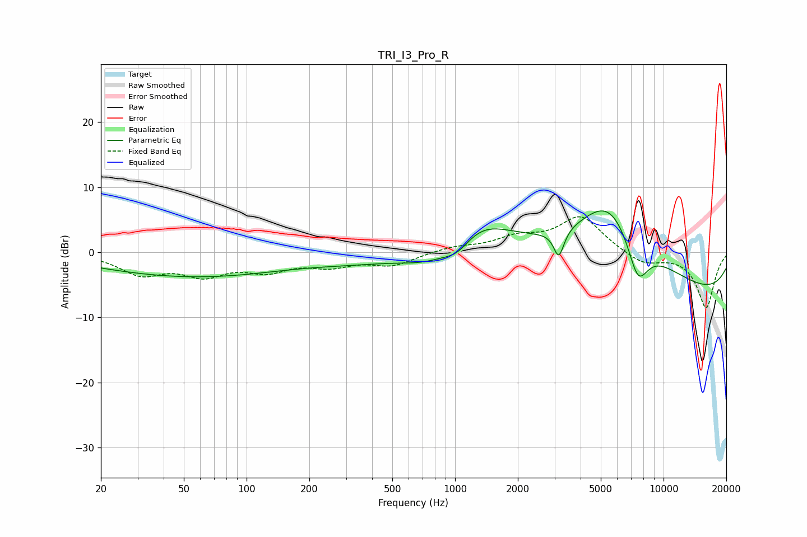

# TRI_I3_Pro_R
See [usage instructions](https://github.com/jaakkopasanen/AutoEq#usage) for more options and info.

### Parametric EQs
Apply preamp of -6.4 dB when using parametric equalizer.

|   # | Type    |   Fc (Hz) |    Q |   Gain (dB) |
|-----|---------|-----------|------|-------------|
|   1 | Peaking |        99 | 0.18 |        -4.4 |
|   2 | Peaking |       195 | 0.53 |         1.5 |
|   3 | Peaking |       752 | 1.02 |        -3.4 |
|   4 | Peaking |      1030 | 1.75 |        -4.1 |
|   5 | Peaking |      1151 | 0.76 |         7.9 |
|   6 | Peaking |      3146 | 5.76 |        -4.2 |
|   7 | Peaking |      5507 | 1.1  |         5.1 |
|   8 | Peaking |      5654 | 0.51 |         9   |
|   9 | Peaking |      7526 | 2.49 |        -7.3 |
|  10 | Peaking |     10000 | 0.18 |        -7.4 |

### Fixed Band EQs
When using fixed band (also called graphic) equalizer, apply preamp of **-5.5 dB** (if available) and set gains manually with these parameters.

|   # | Type    |   Fc (Hz) |    Q |   Gain (dB) |
|-----|---------|-----------|------|-------------|
|   1 | Peaking |        31 | 1.41 |        -3.1 |
|   2 | Peaking |        62 | 1.41 |        -3.1 |
|   3 | Peaking |       125 | 1.41 |        -2.4 |
|   4 | Peaking |       250 | 1.41 |        -1.8 |
|   5 | Peaking |       500 | 1.41 |        -1.9 |
|   6 | Peaking |      1000 | 1.41 |         0.8 |
|   7 | Peaking |      2000 | 1.41 |         2   |
|   8 | Peaking |      4000 | 1.41 |         5.4 |
|   9 | Peaking |      8000 | 1.41 |        -1.9 |
|  10 | Peaking |     16000 | 1.41 |        -8.5 |

### Graphs

